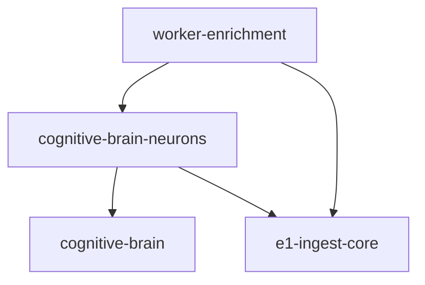

# ADR-0009 — Neuron ca unitate de livrare (pachete `e1-ingest-core`, `cognitive-brain*`)

| Câmp | Valoare |
| --- | --- |
| ID | ADR-0009 |
| Status | Acceptat (documentare + direcție implementare) |
| Data | 2026-04-14 |
| Nivel | Global (CognitiveBrain) |

## Context

Pilotul **ingest CSV** (`bronze:ingest:csv-parser` ↔ `ingest:csv`) folosește astăzi logică în `workers/enrichment` și un modul mare partajat `ingest-utils.ts` (folosit și de a2–a5). Obiective:

1. **Documentație înainte de cod** — `contracts/`, `runtime/neurons/`, `runtime/synapses/.../ROUTING.md`.
2. **Izolare nucleu ingest** reutilizabil: pachet `@cerniq/e1-ingest-core`.
3. **Manifest neuronal** și sinapse ca module: `@cerniq/cognitive-brain` (convenții, tipuri SSE) și `@cerniq/cognitive-brain-neurons` (handler + `synapses/`).
4. **Fără cicluri pnpm** — pachetele nu pot importa `workers/*/src`.

## Decizie

| Pachet | Rol | Dependențe permise (orientativ) |
| --- | --- | --- |
| `@cerniq/e1-ingest-core` | Inserare bronze, triggere normalizare + ANAF bronze, mapări cozi B1–B4 | `@cerniq/db`, `@cerniq/worker-shared`, `@cerniq/observability`, `@cerniq/shared-types` — **nu** `worker-enrichment` |
| `@cerniq/cognitive-brain` | Tipuri wire SSE compatibile API, convenții fără I/O greu | `worker-shared` (thin imports) unde deja folosit în monorepo |
| `@cerniq/cognitive-brain-neurons` | `bronze-ingest-csv-parser-handler.ts` + `synapses/*` pentru pilot CSV | `cognitive-brain`, `e1-ingest-core` |

**Worker `@cerniq/worker-enrichment`:** rămâne **glue** BullMQ — importă handler-ii din `cognitive-brain-neurons` / `e1-ingest-core`, `withCognitiveSpan`, `buildCognitiveWorkerEventContext`.

## DAG (interzis)

- **`e1-ingest-core` → `worker-enrichment`** (ciclu).
- **`cognitive-brain-neurons` → `workers/enrichment/src`** (anti-pattern).

## G7 — `cui-validation` și `pipeline-utils`

`ingest-utils.ts` importă `../lib/cui-validation.js` și `./pipeline-utils.js` (`createHitlApprovalTask`, `logEnrichmentAudit`). Mutarea naivă a întregului `insertBronzeRows` în `e1-ingest-core` fără strategie creează risc de ciclu sau blast radius.

**Strategie aleasă (injectare / hooks):** API public în `e1-ingest-core` acceptă **hook-uri** (sau modul `configureE1IngestHooks`) pentru:

- `sanitizeCui` (compatibil cu `workers/enrichment/src/lib/cui-validation.ts`)
- `createHitlApprovalTask`, `logEnrichmentAudit` (compatibil cu `pipeline-utils.ts`)

Worker-ul apelează **o singură dată** la încărcarea modulului `ingest-utils` `configureE1IngestWorkerHooks({ ... })` cu implementările reale. **Alternativă documentată:** mutare funcții în `@cerniq/worker-shared` dacă devin transversale — cere ADR suplimentar.

**Ordine PR:** documentare strategie în ADR (PR-D0); **implementare hook-uri înainte de mutarea completă `insertBronzeRows`** (PR-P2–P3).

## Migrare incrementală `ingest-utils.ts`

1. **PR-P2:** mută `triggerNormalizationForContacts`, `triggerAnafBronzeEnrichment` și constanta `NORMALIZATION_WORKER_BY_QUEUE` în `e1-ingest-core`; `ingest-utils` re-export sau import delegat.
2. **PR-P3:** mută `insertBronzeRows` / `insertBronzePayloadSafely` și lanțul privat asociat, cu **G7** rezolvat prin hooks.
3. **PR-P4:** extrage logica specifică CSV din `a1-csv-parser.ts` în `cognitive-brain-neurons`; worker subțire + **G1** SSE (`buildCognitiveWorkerEventContext`).

## Legături ADR

- [ADR-0001 — Runtime neuron authority](./ADR-0001-runtime-neuron-authority.md)
- [ADR-0002 — Semantic neuron authority](./ADR-0002-semantic-neuron-authority.md)
- [ADR-0003 — Telemetry backbone](./ADR-0003-telemetry-backbone.md)
- [ADR-0004 — Event spine direction](./ADR-0004-event-spine-direction.md)

## Research extern (SSE / OTel)

| Temă | URL | Acces |
| --- | --- | --- |
| EventSource | [MDN — `EventSource`](https://developer.mozilla.org/en-US/docs/Web/API/EventSource) | 2026-04-14 |
| SSE spec | [WHATWG HTML — Server-sent events](https://html.spec.whatwg.org/multipage/server-sent-events.html) | 2026-04-14 |
| Messaging metrics | [OpenTelemetry — Messaging metrics](https://opentelemetry.io/docs/specs/semconv/messaging/messaging-metrics/) | 2026-04-14 |

## Criterii de „gata” (pilot CSV)

- ROUTING + contract ANAF + contract neuron A–E publicate.
- `e1-ingest-core` și neuroni compensează fără ciclu; teste și `pnpm verify:coverage-policy` pe pachetele atinse.
- G1 închis (context SSE batch) cu test.
- `NEURON_MATRIX.md` — `status_implementare` pentru rândul pilot actualizat cu dovadă.
