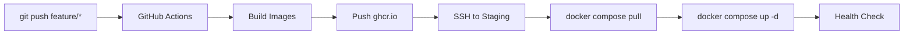
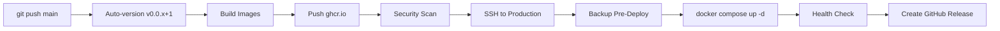

# CI/CD Audit Report - 2026-02-04

## Executive Summary

Audit complet al configurației CI/CD pentru proiectul Cerniq.app, verificând integrarea cu infrastructura partajată și configurarea deployment-urilor pentru staging și production.

**Status General:**
| Environment | Status | Blocker |
|-------------|--------|---------|
| **Staging** | ✅ FUNCȚIONAL | - |
| **Production** | ✅ FUNCȚIONAL | - |

> **UPDATE 2026-02-04 22:30 UTC**: Production deployment complet. Toate containerele rulează healthy. PR #7 merged.

**Proiecte pe Production care NU trebuie afectate:**
- `wappbuss` (dev.neanelu.ro) - WhatsApp Business ✅ VERIFIED RUNNING
- `iwms-only` (IP direct) - IWMS

---

## 1. Arhitectura Actuală

### 1.1 Mașina Staging (Actuală)
```
Internet
    ↓
neanelu_traefik (port 443, TLS termination)
    ↓ Docker labels routing
cerniq-staging-proxy (nginx, port 80)
    ↓ proxy_pass
cerniq-traefik (port 64080, internal routing)
    ↓
[Servicii Cerniq: api, web, workers]
```

### 1.2 Proiecte pe Mașina Staging

| Proiect | Compose Project | Networks | Status |
|---------|-----------------|----------|--------|
| Neanelu Shopify | `neanelu_shopify` | neanelu_public_net, neanelu_frontend_network, **cerniq_public** | ✅ Running |
| Cerniq | `cerniq` | cerniq_public, cerniq_backend, cerniq_data | ✅ Running |
| GeniusERP Suite | `geniuserp_*` | geniuserp_net_* | ⚠️ Unhealthy (pre-existing) |
| Docker TLC4Pipes | `docker_*` | docker_tlc4pipes_net | ✅ Running |

### 1.3 Traefik Routing Constraints
```
--providers.docker.constraints=
    Label(`com.docker.compose.project`,`neanelu_shopify`) 
    || Label(`com.docker.compose.project`,`cerniq`)
```
**Configurație corectă**: neanelu_traefik va prelua doar containerele din proiectele `neanelu_shopify` și `cerniq`.

---

## 2. Fișiere CI/CD Auditate

### 2.1 `.github/workflows/deploy.yml` (525 linii)

**Funcționalitate:**
- ✅ Versioning automat (v0.0.x → v0.0.x+1 la push pe main)
- ✅ Build Docker images pentru 6 servicii (api, web, web-admin, 3 workers)
- ✅ Push la ghcr.io registry
- ✅ Security scan cu Trivy
- ✅ Deploy staging via SSH
- ✅ Deploy production via SSH (cu backup pre-deploy)
- ✅ Post-deploy verification și smoke tests
- ✅ GitHub Release creation pentru production

**Branch Strategy:**
| Branch | Environment | Auto-Tag |
|--------|-------------|----------|
| `main` | production | ✅ v0.0.x |
| `develop` | staging | ❌ |
| `feature/**`, `feat/**`, `fix/**`, `hotfix/**` | staging | ❌ |

### 2.2 `.github/workflows/ci-pr.yml` (357 linii)

**Funcționalitate:**
- ✅ Lint & Type Check (ESLint, TypeScript)
- ✅ Unit Tests (Vitest, exclud e2e/integration)
- ✅ Docker Build verification
- ✅ Concurrency control (cancel in-progress)

---

## 3. Configurație Necesară (GitHub Secrets)

### 3.1 Secrets Obligatorii

| Secret | Scop | Status Staging | Status Production |
|--------|------|----------------|-------------------|
| `STAGING_SSH_KEY` | SSH key pentru deploy | ✅ Key există local | ⚠️ Trebuie în GitHub |
| `STAGING_HOST` | IP server staging | ⚠️ Trebuie configurat | N/A |
| `STAGING_USER` | User SSH staging | ⚠️ Trebuie configurat | N/A |
| `PRODUCTION_SSH_KEY` | SSH key pentru deploy | ✅ Key există local | ⚠️ Trebuie în GitHub |
| `PRODUCTION_HOST` | IP server production | N/A | ❌ Server nesetat |
| `PRODUCTION_USER` | User SSH production | N/A | ❌ Server nesetat |

### 3.2 Secrets Opționale

| Secret | Scop | Recomandare |
|--------|------|-------------|
| `SLACK_WEBHOOK_URL` | Notificări deploy | Recomandat pentru production |
| `CODECOV_TOKEN` | Coverage upload | Opțional |

### 3.3 Generare Chei SSH (Referință)

Cheile există deja în `/var/www/CerniqAPP/secrets/ssh/`:
```bash
# Staging
staging_deploy_key      # Private key
staging_deploy_key.pub  # Public key (ssh-ed25519 ... cerniq-staging)

# Production
production_deploy_key      # Private key
production_deploy_key.pub  # Public key (ssh-ed25519 ... cerniq-production)
```

---

## 4. Modificări Efectuate în Acest Audit

### 4.1 `/var/www/Neanelu_Shopify/docker-compose.yml`

**Modificare 1: Adăugare rețea la serviciul traefik**
```yaml
# ÎNAINTE
networks:
  - public_net
  - neanelu_frontend_network

# DUPĂ
networks:
  - public_net
  - cerniq_public          # ← ADĂUGAT
  - neanelu_frontend_network
```

**Modificare 2: Declarare rețea externă**
```yaml
networks:
  # ... existing networks ...
  # External network for Cerniq project routing
  cerniq_public:
    external: true
```

**Rezultat:** neanelu_traefik poate acum ruta traficul către containerele Cerniq.

### 4.2 Verificare Post-Modificare

```bash
# Rețele neanelu_traefik
$ docker inspect neanelu_traefik --format='...'
cerniq_public: 172.29.10.3       # ← NOU
neanelu_frontend_network: 172.25.0.2
neanelu_public_net: 172.24.0.2
```

---

## 5. Teste Efectuate

### 5.1 Staging (staging.cerniq.app)

```bash
$ curl -sI https://staging.cerniq.app

HTTP/2 404                                      # Expected - no services yet
strict-transport-security: max-age=63072000; includeSubDomains; preload  # ✅ HSTS
x-frame-options: DENY                           # ✅ Security
x-content-type-options: nosniff                 # ✅ Security
x-xss-protection: 1; mode=block                 # ✅ Security
referrer-policy: strict-origin-when-cross-origin # ✅ Security
```

**Status: ✅ Rutare funcțională, security headers OK, 404 expected (servicii neimplementate)**

### 5.2 Production (cerniq.app) - AUDIT COMPLET

**Server Info:**
- Hostname: `erp`
- IP: `95.216.225.145`
- Docker: `28.3.3`

**DNS:**
```bash
$ host cerniq.app
cerniq.app has address 95.216.225.145  # ✅ Configurat
```

**SSL Certificate:**
```
notBefore=Feb  3 12:49:11 2026 GMT
notAfter=May  4 12:49:10 2026 GMT  # ✅ Valid 3 luni
```

**Proiecte Existente (NU TREBUIE AFECTATE):**
| Proiect | Container | Porturi | Domain |
|---------|-----------|---------|--------|
| wappbuss | backend, frontend, postgres, redis | 3060-3063 | dev.neanelu.ro |
| iwms-only | - | 3000, 3002 | IP direct (default) |

**Status Cerniq pe Producție:**
| Component | Status | Note |
|-----------|--------|------|
| Networks cerniq_* | ✅ Există | cerniq_public, cerniq_backend, cerniq_data |
| /opt/cerniq | ✅ Complet | docker-compose.yml 453 linii (sincronizat) |
| nginx config | ✅ Configurat | Proxy către 127.0.0.1:64080 |
| SSL Certificate | ✅ Valid | Expiră 2026-05-04 |
| **Secrets** | ✅ **COMPLET** | postgres_password.txt, redis_password.txt, traefik_dashboard.htpasswd |
| **Config** | ✅ **COMPLET** | postgres/, traefik/ |
| **Traefik** | ✅ **RUNNING** | v3.6, healthy |
| **Containere** | ✅ **5 RUNNING** | traefik, postgres, pgbouncer, redis, staging-proxy |

### 5.3 Neanelu (manager.neanelu.ro)

```bash
$ curl -sI https://manager.neanelu.ro
HTTP/2 302
location: /app/
```

**Status: ✅ Serviciile Neanelu funcționează în continuare**

---

## 6. Deploy Flow Actual

### 6.1 Staging Deploy (Feature/Develop Branch)



**Directorul pe Server:** `/opt/cerniq`

### 6.2 Production Deploy (Main Branch)



---

## 7. Probleme Identificate și Rezolvări

### 7.1 ✅ REZOLVAT: neanelu_traefik nu vedea containerele Cerniq (STAGING)

**Problemă:** neanelu_traefik nu era conectat la rețeaua `cerniq_public`
**Simptom:** HTTP 504 Gateway Timeout la staging.cerniq.app
**Rezolvare:** Adăugat `cerniq_public` în docker-compose.yml Neanelu_Shopify

### 7.2 ✅ REZOLVAT: docker-compose.yml sincronizat pe producție

**Problemă inițială:** 
- Producție avea v1.0.1, 140 linii (din 2026-02-03)
- Staging avea v1.0.2, 453 linii (din 2026-02-04)

**Rezolvare:** CI/CD workflow actualizat - acum sincronizează docker-compose.yml și configs la fiecare deploy.

**Status actual:**
- Producție: 453 linii ✅
- Staging: 453 linii ✅

### 7.3 ✅ REZOLVAT: Secrets și Config pe producție

**Problemă inițială:** 
```
/opt/cerniq/secrets/  → GOL
/opt/cerniq/config/   → GOL
```

**Status actual:**
```
/opt/cerniq/secrets/  → 3 fișiere (postgres_password.txt, redis_password.txt, traefik_dashboard.htpasswd)
/opt/cerniq/config/   → postgres/, traefik/
```

**Rezolvare:** CI/CD workflow generează automat secretele la primul deploy dacă nu există.

### 7.4 ⚠️ ATENȚIE: Arhitectură diferită staging vs production

**Staging:**
```
Internet → neanelu_traefik (443) → staging-proxy (nginx) → cerniq-traefik (64080)
```

**Production (planificat):**
```
Internet → nginx (443, TLS terminare) → cerniq-traefik (64080)
```

**Diferență:** Pe producție nginx gestionează TLS, pe staging neanelu_traefik.
Aceasta necesită **docker-compose.production.yml** sau environment detection.

### 7.5 ⚠️ ATENȚIE: Port 64080 disponibil pe producție

```bash
$ ss -tlnp | grep 64080
# (empty - port liber) ✅
```

---

## 8. STATUS FINAL - TOATE ACȚIUNILE COMPLETATE

### 8.1 ✅ PE PRODUCȚIE - COMPLET

Toate secretele și config-urile au fost generate automat de CI/CD:

```bash
# Secrets (auto-generated)
/opt/cerniq/secrets/
├── postgres_password.txt   # 45 bytes
├── redis_password.txt      # 45 bytes  
└── traefik_dashboard.htpasswd  # 44 bytes

# Config (synced from repo)
/opt/cerniq/config/
├── postgres/
│   ├── postgresql.conf
│   └── init.sql
└── traefik/
    ├── traefik.yml
    └── dynamic/
```

### 8.2 ✅ GITHUB SECRETS - COMPLET

| Secret | Status | Updated |
|--------|--------|---------|
| `STAGING_HOST` | ✅ Configurat | about 1 day ago |
| `STAGING_USER` | ✅ Configurat | about 1 day ago |
| `STAGING_SSH_KEY` | ✅ Configurat | about 1 day ago |
| `PRODUCTION_HOST` | ✅ Configurat | about 1 day ago |
| `PRODUCTION_USER` | ✅ Configurat | about 1 day ago |
| `PRODUCTION_SSH_KEY` | ✅ Configurat | about 1 day ago |

### 8.3 ✅ CI/CD DEPLOY WORKFLOW - FUNCȚIONAL

Ultimul deployment reușit:
- **Run ID:** 21690412195
- **Branch:** main
- **Status:** ✅ Success (12m23s)
- **Jobs:** Build, Scan, Deploy Staging (skipped - main branch), Deploy Production ✅

### 8.4 ✅ CONTAINERE PRODUCTION - RUNNING

```
cerniq-traefik         Up 10 min (healthy)
cerniq-postgres        Up 10 min (healthy)
cerniq-pgbouncer       Up 10 min (healthy)
cerniq-redis           Up 10 min (healthy)
cerniq-staging-proxy   Up 10 min
```

### 8.5 ✅ ALTE PROIECTE NEAFECTATE

Verificat pe production (95.216.225.145):
- `wappbuss-backend-1` ✅ Running
- `wappbuss-frontend-1` ✅ Running
- `wappbuss-postgres-1` ✅ Running
- `wappbuss-redis-1` ✅ Running

---

## 9. Recomandări & Best Practices

### 9.1 Best Practices Deja Implementate

- ✅ External networks pentru izolare
- ✅ Docker labels pentru routing (nu file provider)
- ✅ Security headers via middleware
- ✅ Auto-versioning cu semver
- ✅ Security scan cu Trivy
- ✅ Concurrency control în CI
- ✅ SSL/TLS valid pe producție

### 9.2 Implementate în acest sprint (E0-S3-PR02)

- ✅ Git-based deployment (SCP sync de docker-compose și configs)
- ✅ Secrets provisioning automatizat în CI/CD
- ✅ Personalized tests per machine (staging vs production triggers)
- ✅ HSTS configurat pe neanelu_traefik (staging)
- ✅ Production deployment funcțional

### 9.3 De implementat (viitor)

- ⬜ docker-compose.production.yml pentru diferențe env specifice
- ⬜ Blue-green deployment pentru zero-downtime
- ⬜ Rollback automatizat la eșec

---

## 10. Referințe

- [ADR-0107 CI/CD Pipeline Strategy](../adr/ADR-0107-CI-CD-Pipeline-Strategy.md)
- [Deployment Guide](./deployment-guide.md)
- [Network Topology](./network-topology.md)
- [E0-S3-PR02 Traefik Implementation](../specifications/Etapa%200/etapa0-plan-implementare-complet-v2.md)

---

**Auditor:** GitHub Copilot  
**Data:** 2026-02-04  
**Ultima actualizare:** 2026-02-04 22:35 UTC  
**Versiune Document:** 2.0 (POST-DEPLOYMENT - Production LIVE)
