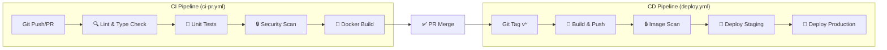
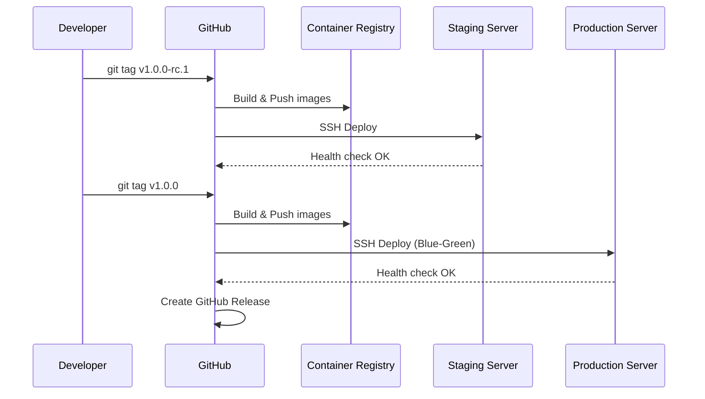

# CI/CD Pipeline

> **Document Version:** 2.0 | **Updated:** 2026-02-01 | **ADR:** [ADR-0107](../adr/ADR%20Etapa%200/ADR-0107-CI-CD-Pipeline-Strategy.md)

**Cerniq.app** folosește [GitHub Actions](https://github.com/features/actions) pentru integrare și livrare continuă.

---

## 📊 Stare Curentă vs Roadmap

| Component | Stare Curentă (Etapa 0) | Target (Etapa 1) |
|-----------|------------------------|------------------|
| CI Pipeline | ✅ Implementat | ✅ Complet |
| CD Pipeline | ✅ Implementat (manual trigger) | 🔄 Auto-deploy pe tag |
| Branch Protection | ⚠️ De configurat | ✅ Enforced |
| Secrets Management | ⚠️ De configurat | ✅ GitHub Secrets |
| Notifications | ⚠️ Placeholder | ✅ Slack Integration |

---

## 1. Pipeline Overview



---

## 2. CI Pipeline (`ci-pr.yml`)

**Locație:** `.github/workflows/ci-pr.yml`  
**Trigger:** Push pe `main`/`develop`, Pull Requests  
**Status:** ✅ IMPLEMENTAT

### 2.1 Job: Lint & Type Check

| Aspect | Detalii |
|--------|---------|
| **Tools** | ESLint 9, TypeScript Compiler (tsc) |
| **Scope** | Toate fișierele din `apps/`, `packages/`, `workers/` |
| **Timeout** | 10 minute |
| **Comenzi** | `pnpm lint`, `pnpm typecheck` |

### 2.2 Job: Tests

| Aspect | Detalii |
|--------|---------|
| **Tool** | Vitest |
| **Scope** | `packages/**`, `apps/**` |
| **Services** | PostgreSQL 18.1 + PostGIS, Redis 8.4.0 |
| **Timeout** | 15 minute |
| **Coverage** | Upload to Codecov |

**Service Containers:**
```yaml
services:
  postgres:
    image: postgis/postgis:18-3.6
  redis:
    image: redis:8.4.0-alpine
```

### 2.3 Job: Security Scan

| Aspect | Detalii |
|--------|---------|
| **Tool** | Trivy (filesystem scan) |
| **Scope** | Toate dependențele npm |
| **Policy** | `CRITICAL` + `HIGH` → blochează PR |
| **Output** | SARIF → GitHub Security Tab |

### 2.4 Job: Docker Build Verification

| Aspect | Detalii |
|--------|---------|
| **Tool** | Docker Buildx |
| **Images** | `api`, `web` |
| **Push** | ❌ Nu (doar verificare build) |
| **Cache** | GitHub Actions Cache (GHA) |

### 2.5 Job: Python Lint (Condiționat)

| Aspect | Detalii |
|--------|---------|
| **Trigger** | Doar când `workers/` este modificat |
| **Tools** | Ruff, mypy |
| **Python** | 3.14 |

---

## 3. CD Pipeline (`deploy.yml`)

**Locație:** `.github/workflows/deploy.yml`  
**Trigger:** Push tag `v*.*.*`, Manual dispatch  
**Status:** ✅ IMPLEMENTAT

### 3.1 Workflow Triggers

```yaml
on:
  push:
    tags:
      - 'v*.*.*'         # Orice tag semantic versioning
  workflow_dispatch:      # Manual cu alegere environment
```

### 3.2 Job: Build & Push Images

| Aspect | Detalii |
|--------|---------|
| **Registry** | GitHub Container Registry (ghcr.io) |
| **Images** | api, web, web-admin, worker-ai, worker-enrichment, worker-outreach |
| **Tags** | `v{version}`, `sha-{commit}` |
| **Build Args** | VERSION, BUILD_SHA |

### 3.3 Job: Security Scan Images

- Scanare Trivy pe fiecare imagine publicată
- Output SARIF pentru GitHub Security tab
- `continue-on-error: true` (nu blochează deploy)

### 3.4 Job: Deploy to Staging

| Aspect | Detalii |
|--------|---------|
| **Trigger** | Tag cu `-rc`, `-beta`, `-alpha` sau manual |
| **Environment** | `staging` (GitHub Environment) |
| **URL** | https://staging.cerniq.app |
| **Method** | SSH + Docker Compose |

### 3.5 Job: Deploy to Production

| Aspect | Detalii |
|--------|---------|
| **Trigger** | Tag `vX.Y.Z` (fără suffix) sau manual |
| **Environment** | `production` (GitHub Environment) |
| **URL** | https://app.cerniq.app |
| **Method** | SSH + Docker Compose (Blue-Green) |
| **Pre-deploy** | Database backup automat |

### 3.6 Deployment Flow



---

## 4. Configurare Necesară

### 4.1 GitHub Secrets (De Configurat)

| Secret | Scop | Status |
|--------|------|--------|
| `CODECOV_TOKEN` | Upload coverage | ⚠️ Optional |
| `STAGING_SSH_KEY` | Deploy staging | ⚠️ Required |
| `STAGING_HOST` | Staging server IP | ⚠️ Required |
| `STAGING_USER` | SSH user staging | ⚠️ Required |
| `PRODUCTION_SSH_KEY` | Deploy production | ⚠️ Required |
| `PRODUCTION_HOST` | Production server IP | ⚠️ Required |
| `PRODUCTION_USER` | SSH user production | ⚠️ Required |
| `SLACK_WEBHOOK_URL` | Notifications | ⚠️ Optional |

### 4.2 GitHub Environments

Configurați în **Settings → Environments**:

1. **staging**
   - URL: https://staging.cerniq.app
   - No required reviewers
   
2. **production**
   - URL: https://app.cerniq.app
   - Required reviewers: 1+ (recomandat)
   - Wait timer: 5 minute (recomandat)

### 4.3 Branch Protection Rules

Configurați pentru `main`:

```
☑️ Require a pull request before merging
☑️ Require status checks to pass
    - ci-status (required)
☑️ Require branches to be up to date
☑️ Do not allow bypassing the above settings
```

---

## 5. Utilizare

### 5.1 CI - Automatic

```bash
# CI rulează automat la:
git push origin feature/my-feature    # Push pe orice branch
git push origin main                   # Push pe main
# + la orice PR deschis
```

### 5.2 CD - Tag Release

```bash
# Deploy staging (pre-release)
git tag v1.0.0-rc.1
git push origin v1.0.0-rc.1

# Deploy production (release)
git tag v1.0.0
git push origin v1.0.0
```

### 5.3 CD - Manual Dispatch

1. Go to **Actions** → **CD Pipeline**
2. Click **Run workflow**
3. Select environment: `staging` / `production`
4. Enter version: `v1.0.0`
5. Click **Run workflow**

---

## 6. Troubleshooting

### 6.1 CI Fails on Lint

```bash
# Local fix
pnpm lint --fix
pnpm typecheck
```

### 6.2 CI Fails on Tests

```bash
# Run tests locally with same services
docker compose -f docker/docker-compose.test.yml up -d
pnpm test
```

### 6.3 CD Fails on Deploy

1. Check SSH connectivity to server
2. Verify secrets are correctly set
3. Check server disk space
4. Review deployment logs in Actions

---

## 7. Referințe

- **ADR:** [ADR-0107 CI/CD Pipeline Strategy](../adr/ADR%20Etapa%200/ADR-0107-CI-CD-Pipeline-Strategy.md)
- **Deployment Guide:** [deployment-guide.md](deployment-guide.md)
- **Security Policy:** [security-policy.md](../governance/security-policy.md)
- **Technical Debt:** TD-I01 în [technical-debt-board.md](../architecture/technical-debt-board.md)
