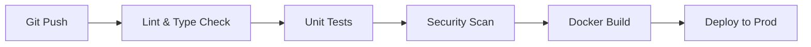

# CI/CD Pipeline

**Cerniq.app** folosește [GitHub Actions](https://github.com/features/actions) pentru integrare și livrare continuă.
Pipeline-ul este definit în `.github/workflows/ci-pr.yml` și `.github/workflows/deploy.yml` (viitor).

## 1. Pipeline Overview

## 2. CI Jobs (`ci-pr.yml`)

Acest workflow rulează automat la fiecare Pull Request și Push pe `main`.

### 2.1 Linting & Static Analysis

- **Tools**: ESLint 9, Birome, TSC (TypeScript Compiler).
- **Scope**: Verifică erori de sintaxă, tipare și stil.
- **Fail Fast**: Oprește pipeline-ul dacă există erori.

### 2.2 Testing

- **Tool**: Vitest.
- **Scope**: Rulează toate testele din `packages/**` și `apps/**`.
- **Services**: Ridică containere efemere pentru Redis și Postgres (dacă necesar).

### 2.3 Security Scan

- **Tool**: Trivy FS / Grype.
- **Scope**: Scanează dependențele (npm) pentru vulnerabilități critice (CVE-uri).
- **Policy**: Doar vulnerabilitățile `HIGH` sau `CRITICAL` blochează PR-ul.

### 2.4 Docker Smoke Build

- **Tool**: Docker Buildx.
- **Scope**: Verifică dacă imaginile Docker (`api`, `web-admin`, `workers`) se compilează cu succes.
- **Cache**: GitHub Actions Cache pentru layer-ele Docker.

## 3. Deployment Strategy (GC-07)

> Notă: În Etapa 0, deployment-ul este manual (vezi [`deployment-guide.md`](../infrastructure/deployment-guide.md)).
> Automatazarea completă este planificată pentru Etapa 1.

### Planned CD Workflow

1. **Trigger**: Push pe tag `v*` (ex: `v0.0.1`).
2. **Build**: Build multi-arch images (amd64).
3. **Push**: Push în GHCR (GitHub Container Registry).
4. **Deploy**: SSH în serverul Hetzner și rulare `docker stack deploy` sau update service.
