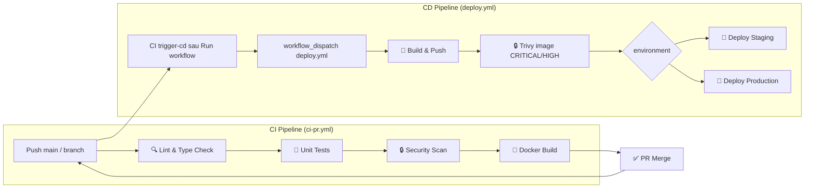
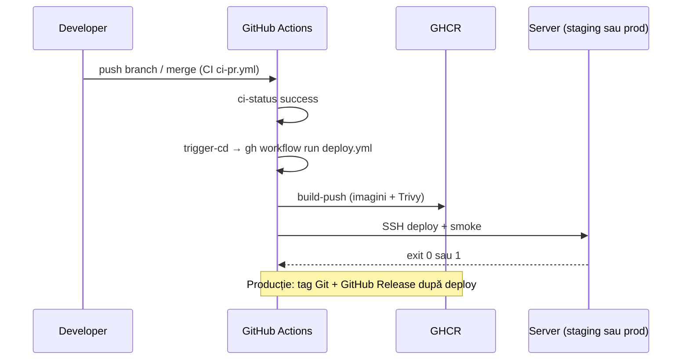
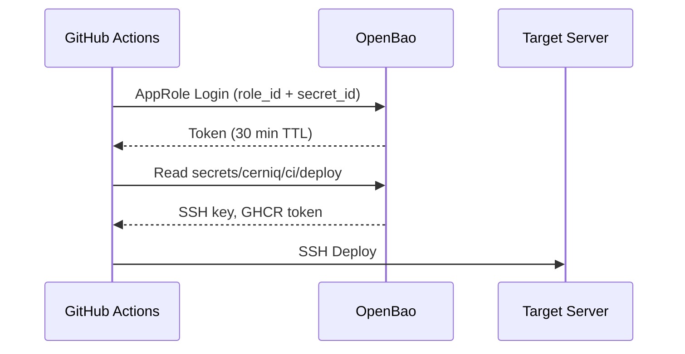

# CI/CD Pipeline

> **Document Version:** 3.1 | **Updated:** 2026-04-05 | **ADR:** [ADR-0032](../adr/ADR%20Etapa%200/ADR-0032-CI-CD-Pipeline-Strategy.md), [ADR-0033](../adr/ADR%20Etapa%200/ADR-0033-OpenBao-Secrets-Management.md)

**Cerniq.app** folosește [GitHub Actions](https://github.com/features/actions) pentru integrare și livrare continuă, cu **OpenBao** pentru gestionarea secretelor.

---

## 📊 Stare Curentă vs Roadmap

| Component | Stare Curentă (Etapa 0) | Target (Etapa 1) |
| --------- | ----------------------- | ---------------- |
| CI Pipeline | ✅ Implementat | ✅ Complet |
| CD Pipeline | ✅ Implementat (`workflow_dispatch` + trigger din CI) | 🔄 Extinderi smoke / ingress |
| Branch Protection | ⚠️ De configurat | ✅ Enforced |
| **Secrets Management** | **✅ OpenBao** 🆕 | **✅ Dynamic secrets** |
| Notifications | ⚠️ Placeholder | ✅ Slack Integration |

---

## 1. Pipeline Overview


```mermaid
graph LR
    subgraph CI ["CI Pipeline (ci-pr.yml)"]
        Push[Git Push/PR] --> Lint[🔍 Lint & Type Check]
        Lint --> Test[🧪 Unit Tests]
        Test --> Security[🔒 Security Scan]
        Security --> Build[🐳 Docker Build]
    end

    subgraph CD ["CD Pipeline (deploy.yml)"]
        Trig[CI trigger-cd sau Run workflow] --> WFD[workflow_dispatch deploy.yml]
        WFD --> BuildPush[🐳 Build & Push]
        BuildPush --> Scan[🔒 Trivy image CRITICAL/HIGH]
        Scan --> Pick{environment}
        Pick --> Staging[🚀 Deploy Staging]
        Pick --> Prod[🚀 Deploy Production]
    end

    Build --> Merge[✅ PR Merge]
    Merge --> Push[Push main / branch]
    Push --> Trig
```

---

## 2. CI Pipeline (`ci-pr.yml`)

**Locație:** `.github/workflows/ci-pr.yml`  
**Trigger:** Push pe `main`/`develop`, Pull Requests  
**Status:** ✅ IMPLEMENTAT

### 2.1 Job: Lint & Type Check

| Aspect      | Detalii                                                                              |
| ----------- | ------------------------------------------------------------------------------------ |
| **Tools**   | ESLint 9, Prettier 3, TypeScript Compiler (`tsc`)                                    |
| **Scope**   | Toate fișierele din `apps/`, `packages/`, `workers/`                                 |
| **Timeout** | 10 minute                                                                            |
| **Comenzi** | `pnpm lint`, `pnpm prettier --check .`, `pnpm typecheck`, `pnpm verify:sonar-config` |

**SonarCloud (scan + Quality Gate):** job dedicat `sonarcloud` în același workflow, dar **condiționat** de variabila de repository `SONAR_SCAN=true` (GitHub → Settings → Actions → Variables). Dacă variabila lipsește sau nu este `true`, jobul este **skipped** (acceptat la `ci-status`). Token: fișier randat OpenBao / KV `secret/cerniq/ci/sonar` / secret repo `SONAR_TOKEN` (vezi pașii din job). **Nu există** scan Sonar în `deploy.yml` — CD presupune că integrarea pe PR a trecut prin CI.

**CD (`deploy.yml`):** nu re-rulează `lint` / `prettier` / `typecheck`; declanșare manuală sau din CI după verificări verzi.

### 2.2 Job: Tests

| Aspect       | Detalii                                                                                 |
| ------------ | --------------------------------------------------------------------------------------- |
| **Tool**     | Vitest                                                                                  |
| **Scope**    | `packages/**`, `apps/**`                                                                |
| **Services** | PostgreSQL 18 + PostGIS (`postgis/postgis:18-3.6`), Redis 8.6 (`redis:8.6.0`)           |
| **Timeout**  | 15 minute                                                                               |
| **Coverage** | Upload to Codecov                                                                       |

**Service Containers:**

```yaml
services:
  postgres:
    image: postgis/postgis:18-3.6
  redis:
    image: redis:8.6.0
```

### 2.3a Teste infrastructură (repo) și k6 (manual)

| Suite | Comandă / loc | CI |
| ----- | ------------- | -- |
| Validări statice Etapa 0 (workflow, compose, YAML) | `pnpm test:infra` → `tests/e2e/infrastructure/**/*.test.ts` | Opțional / local (nu este în `lint` în mod implicit; rulează la nevoie sau adaugă job dedicat). |
| Load Etapa 1 | `pnpm test:load:etapa1` → `tests/performance/etapa1-throughput.k6.js` | Manual; necesită binar [k6](https://k6.io/) pe mașina rulatoare. |

Variabila de mediu `WORKSPACE_ROOT` (implicită în unele spec-uri: calea către rădăcina repo-ului) trebuie setată dacă rulezi din alt director.

### 2.3 Job: Security Scan

| Aspect     | Detalii                            |
| ---------- | ---------------------------------- |
| **Tool**   | Trivy (filesystem scan)            |
| **Scope**  | Toate dependențele npm             |
| **Policy** | `CRITICAL` + `HIGH` → blochează PR |
| **Output** | SARIF → GitHub Security Tab        |

### 2.4 Job: Docker Build Verification

| Aspect     | Detalii                                                                  |
| ---------- | ------------------------------------------------------------------------ |
| **Tool**   | Docker Buildx                                                            |
| **Images** | `api`, `web`, `web-admin`, `monitoring-api` (dacă există Dockerfile-uri) |
| **Push**   | Nu (doar verificare build; fără push în registry)                        |
| **Cache**  | GitHub Actions Cache (GHA)                                               |

### 2.5 Job: Python Lint (Condiționat)

| Aspect      | Detalii                             |
| ----------- | ----------------------------------- |
| **Trigger** | Doar când `workers/` este modificat |
| **Tools**   | Ruff, mypy                          |
| **Python**  | 3.14 (rulat ca `python3`)           |

---

## 3. CD Pipeline (`deploy.yml`)

**Locație:** `.github/workflows/deploy.yml`  
**Trigger:** **Doar** `workflow_dispatch` (nu `push` și nu `push` de tag pe acest workflow). Apelare: (1) job **`trigger-cd`** din [`.github/workflows/ci-pr.yml`](../../.github/workflows/ci-pr.yml) după `ci-status` cu succes pe **push**; (2) **Run workflow** manual din UI GitHub.  
**Status:** ✅ IMPLEMENTAT

### 3.1 Workflow Triggers și intrări

```yaml
on:
  workflow_dispatch:
    inputs:
      environment: staging | production
      version: string # ex. v0.0.12 sau nume-branch-scurtat + sha
      rollback: boolean # doar job rollback
```

- **`trigger-cd` (CI):** pe `main` → `environment=production` și versiune `v0.0.N` (increment față de ultimul tag `v0.0.*` din API GitHub); pe alte branch-uri → `environment=staging` și versiune derivată din numele branch-ului + SHA scurt.
- **Tag-ul Git** pentru producție: job-ul **`setup`** poate crea și împinge tag-ul (`should_tag`) când `environment == production` (vezi pașii din workflow).

### 3.2 Joburi (rezumat)

| Job | Condiție principală | Rol |
| --- | --- | --- |
| `setup` | întotdeauna (la run normal) | Determină `environment`, `version`, `sha`; tag Git la producție |
| `build-push` | `inputs.rollback != true` | Matrice imagini: api, web, web-admin, monitoring-api, worker-enrichment → push GHCR |
| `deploy-staging` | `needs.setup.outputs.environment == 'staging'` | SSH staging, sync config, compose, migrări, smoke |
| `deploy-production` | `needs.setup.outputs.environment == 'production'` | SSH producție, backup DB, deploy, smoke, release GitHub |
| `summary` | succes staging sau producție | Rezumat în GitHub Step Summary |
| `rollback` | `inputs.rollback == true` | SSH: citește `/opt/cerniq/.previous_deploy`, compose pull/up |

### 3.3 Build & Push + scan imagine

| Aspect | Detalii |
| ------ | ------- |
| **Registry** | `ghcr.io` / `${{ github.repository_owner }}/cerniq/<app>` |
| **Imagini (matrice)** | api, web, web-admin, monitoring-api, worker-enrichment |
| **Trivy** | `trivy image` — severități `CRITICAL,HIGH`, **`--exit-code 1`** → **eșecul blochează** workflow-ul (nu este `continue-on-error` pe acest pas). |

### 3.4 Smoke tests post-deploy (staging și producție)

Pe server, după compose, scriptul SSH verifică în principal:

| Verificare | Comportament în workflow |
| ---------- | ------------------------ |
| **PostgreSQL** | `pg_isready` către host-ul configurat (rețea host) — eșec → `FAILED=1` |
| **PgBouncer** | `psql "$DATABASE_URL"` prin rețea `cerniq_backend` — eșec → mesaj **NOT READY (may be initializing)**; **nu** incrementează `FAILED` în `deploy.yml` (staging și producție) |
| **Redis** | `redis-cli -u "$REDIS_URL" PING` — eșec → `FAILED=1` |
| **Ingress** | `curl -skf https://staging.cerniq.app` / `https://cerniq.app` — **staging:** eșecul este **non-blocking** (mesaj NOT READY, comentariu despre f2-10); **producție:** eșec → `FAILED=1` |
| **OpenBao agents** | health Docker `healthy` pentru `cerniq-openbao-agent-api`, `workers`, `infra` — eșec → `FAILED=1` |
| **fail2ban / UFW** | informative; nu opresc în mod obligatoriu pașii |

#### Gap explicit (runbook)

Smoke-ul **nu** apelează, în pașii documentați aici, endpoint-uri HTTP de health pe containerele **api** / **web** (ex. porturi interne din [ADR-0022](../adr/ADR%20Etapa%200/ADR-0022-Port-Allocation-Strategy.md)). Validarea aplicației prin HTTP rămâne prin **Ingress** (și eventual suite separate: E2E, k6, verificări manuale). Dacă Ingress e marcat non-blocking pe staging, **nu** aveți garanție din acest job că SPA/API răspund — planificați verificări suplimentare.

### 3.5 Rollback

- Declanșare: `workflow_dispatch` cu **`rollback: true`** și același `environment` țintă.
- Server: necesită fișierul **`/opt/cerniq/.previous_deploy`** cu versiunea imaginii anterioare; compose `pull` + `up -d --force-recreate`.

### 3.6 Deployment Flow (actual)


```mermaid
sequenceDiagram
    participant Dev as Developer
    participant GH as GitHub Actions
    participant GHCR as GHCR
    participant Srv as Server (staging sau prod)

    Dev->>GH: push branch / merge (CI ci-pr.yml)
    GH->>GH: ci-status success
    GH->>GH: trigger-cd → gh workflow run deploy.yml
    GH->>GHCR: build-push (imagini + Trivy)
    GH->>Srv: SSH deploy + smoke
    Srv-->>GH: exit 0 sau 1
    Note over GH,GHCR: Producție: tag Git + GitHub Release după deploy
```

---

## 4. OpenBao Integration 🆕

### 4.1 Overview

CI/CD pipeline-ul utilizează **OpenBao AppRole** pentru a obține secretele necesare la deployment:


```mermaid
sequenceDiagram
    participant GHA as GitHub Actions
    participant BAO as OpenBao
    participant Server as Target Server

    GHA->>BAO: AppRole Login (role_id + secret_id)
    BAO-->>GHA: Token (30 min TTL)
    GHA->>BAO: Read secrets/cerniq/ci/deploy
    BAO-->>GHA: SSH key, GHCR token
    GHA->>Server: SSH Deploy
```

### 4.2 GitHub Secrets for OpenBao

| Secret                   | Scop               | Rotație |
| ------------------------ | ------------------ | ------- |
| `OPENBAO_ADDR`           | URL OpenBao server | Static  |
| `OPENBAO_CICD_ROLE_ID`   | AppRole role_id    | Static  |
| `OPENBAO_CICD_SECRET_ID` | AppRole secret_id  | Lunar   |

### 4.2.1 CI Test Secrets (OpenBao KV)

CI Pipeline-ul ia secretele de test din OpenBao:

- Path: `secret/cerniq/ci/test` (KV v1 pe orchestrator; nu folosim `secret/data/...`)
- Keys: `pg_user`, `pg_password`, `redis_password`, `jwt_secret`

**CI constraints (must match service containers):**

- `pg_user` = `c3rn1q`
- `pg_password` = `cerniq_ci`
- `redis_password` empty string (Redis in CI has no password)

**CI connectivity:**

- `OPENBAO_ADDR` must be reachable from the self-hosted runner
- OpenBao este accesat prin Traefik pe orchestrator (HTTPS :443). Nu folosim OpenBao local expus pe porturi de tip `64090`.

### 4.2.2 SonarCloud token (OpenBao KV)

- Path KV v1: `secret/cerniq/ci/sonar`
- Cheie: `token` (token de analiză SonarCloud pentru proiect)
- **Ordinea în CI** (`ci-pr.yml` job `sonarcloud`): (1) fișier randat de agent: `/opt/cerniq/runtime-secrets/ci/sonar.env` sau `vars.CERNIQ_OPENBAO_SONAR_ENV_FILE`; (2) citire directă KV prin AppRole (`OPENBAO_*` secrets); (3) fallback `secrets.SONAR_TOKEN`.
- **Agent OpenBao:** serviciu opțional `openbao-agent-ci-sonar` (profil Docker `ci-sonar`) — vezi `infra/docker/docker-compose.yml`.
- Scriere secret: `infra/scripts/put-openbao-ci-sonar-token.sh` (token pe stdin).
- Inventar: `docs/developer-guide/patterns/openbao-secrets-inventory.md`.

### 4.3 Workflow Integration

Fragment **ilustrativ** (pattern OpenBao + SSH); pașii exacți ai deploy-ului curent sunt în [`.github/workflows/deploy.yml`](../../.github/workflows/deploy.yml) (job-uri `deploy-staging` / `deploy-production`).

```yaml
# Ilustrativ — nu este copie 1:1 a job-urilor actuale
jobs:
  deploy:
    steps:
      - name: Get secrets from OpenBao
        id: openbao
        env:
          BAO_ADDR: ${{ secrets.OPENBAO_ADDR }}
        run: |
          # Login with AppRole
          TOKEN=$(curl -s -X POST "${BAO_ADDR}/v1/auth/approle/login" \
            -d '{"role_id":"${{ secrets.OPENBAO_CICD_ROLE_ID }}","secret_id":"${{ secrets.OPENBAO_CICD_SECRET_ID }}"}' \
            | jq -r '.auth.client_token')

          # Read deployment secrets
          SECRETS=$(curl -s -H "X-Vault-Token: $TOKEN" \
            "${BAO_ADDR}/v1/secret/cerniq/ci/deploy")

          # Export to environment (masked)
          echo "::add-mask::$(echo $SECRETS | jq -r '.data.data.ssh_key')"
          echo "SSH_KEY=$(echo $SECRETS | jq -r '.data.data.ssh_key')" >> $GITHUB_OUTPUT

      - name: Deploy to server
        env:
          SSH_KEY: ${{ steps.openbao.outputs.SSH_KEY }}
        run: |
          echo "$SSH_KEY" > /tmp/deploy_key
          chmod 600 /tmp/deploy_key
          ssh -i /tmp/deploy_key ${{ vars.DEPLOY_USER }}@${{ vars.DEPLOY_HOST }} \
            'cd /var/www/CerniqAPP && ./deploy.sh'
```

### 4.4 AppRole Policy for CI/CD

```hcl
# Path: infra/config/openbao/policies/cicd-policy.hcl
path "secret/cerniq/ci/*" {
  capabilities = ["read"]
}

path "auth/approle/role/api/secret-id" {
  capabilities = ["create", "update"]
}

path "auth/approle/role/workers/secret-id" {
  capabilities = ["create", "update"]
}
```

### 4.5 secret_id Rotation

Secret_id-ul pentru CI/CD trebuie rotit lunar. Pipeline automat:

```yaml
# .github/workflows/rotate-approle-secrets.yml
name: Rotate AppRole Secrets
on:
  schedule:
    - cron: "0 2 1 * *" # First day of month at 02:00 UTC
  workflow_dispatch:

jobs:
  rotate:
    runs-on: ubuntu-latest
    steps:
      - name: Rotate CICD secret_id
        run: |
          # Login și generare nou secret_id
          NEW_SECRET=$(curl -s -X POST "${BAO_ADDR}/v1/auth/approle/role/cicd/secret-id" \
            -H "X-Vault-Token: ${{ secrets.OPENBAO_ADMIN_TOKEN }}" \
            | jq -r '.data.secret_id')

          # Update GitHub secret via API
          gh secret set OPENBAO_CICD_SECRET_ID --body "$NEW_SECRET"
```

---

## 5. Configurare Necesară

### 5.1 GitHub Secrets

| Secret                   | Scop                    | Status      | Sursă             |
| ------------------------ | ----------------------- | ----------- | ----------------- |
| `OPENBAO_ADDR`           | OpenBao server URL      | ✅ Required | Manual            |
| `OPENBAO_CICD_ROLE_ID`   | AppRole role_id         | ✅ Required | OpenBao init      |
| `OPENBAO_CICD_SECRET_ID` | AppRole secret_id       | ✅ Required | OpenBao (rotated) |
| `OPENBAO_ADMIN_TOKEN`    | Pentru rotație automată | ⚠️ Optional | OpenBao root      |
| `CODECOV_TOKEN`          | Upload coverage         | ⚠️ Optional | Codecov           |
| `SLACK_WEBHOOK_URL`      | Notifications           | ⚠️ Optional | Slack             |

> **Note:** SSH keys și deployment secrets sunt acum stocate în OpenBao, nu în GitHub Secrets.

### 5.2 GitHub Environments

Configurați în **Settings → Environments**:

1. **staging**
   - URL: `https://staging.cerniq.app`
   - No required reviewers
2. **production**
   - URL: `https://cerniq.app`
   - Required reviewers: 1+ (recomandat)
   - Wait timer: 5 minute (recomandat)

### 5.3 Branch Protection Rules

Configurați pentru `main`:

```text
☑️ Require a pull request before merging
☑️ Require status checks to pass
    - ci-status (required)
☑️ Require branches to be up to date
☑️ Do not allow bypassing the above settings
```

---

## 6. Utilizare

### 6.1 CI - Automatic

```bash
# CI rulează automat la:
git push origin feature/my-feature    # Push pe orice branch
git push origin main                   # Push pe main
# + la orice PR deschis
```

### 6.2 CD - După CI verde (flux automat)

Pe **push** (nu pe PR în mod izolat pentru trigger-cd), când toate job-urile necesare trec, `ci-pr.yml` rulează **`trigger-cd`**, care execută `gh workflow run deploy.yml` cu:

- **`staging`** pentru branch-uri diferite de `main` (versiune tip `<branch-scurtat>-<sha>`),
- **`production`** pentru `main` (versiune `v0.0.N` incrementală; tag-ul poate fi creat de job-ul `setup` din `deploy.yml`).

**Important:** simplul `git push origin v1.0.0` al unui tag **nu** declanșează `deploy.yml` dacă nu există logică separată; sursa de adevăr este `workflow_dispatch` + `trigger-cd`.

### 6.3 CD - Manual Dispatch și rollback

1. Deschideți **Actions** → **CD Pipeline** (`deploy.yml`).
2. **Run workflow**.
3. Completați `environment`, `version`, opțional `rollback` (doar pentru job-ul de rollback).
4. Rulați workflow-ul.

Pentru **rollback** la versiunea anterioară: același workflow, `rollback: true`, cu `environment` corect; pe server trebuie să existe `/opt/cerniq/.previous_deploy`.

---

## 7. Troubleshooting

### 7.1 CI Fails on Lint

```bash
# Local fix
pnpm lint --fix
pnpm typecheck
```

### 7.2 CI Fails on Tests

```bash
# Run tests locally with same services
docker compose -f docker/docker-compose.test.yml up -d
pnpm test
```

### 7.3 CD Fails on Deploy

1. Check SSH connectivity to server
2. Verify OpenBao AppRole authentication
3. Check server disk space
4. Review deployment logs in Actions

### 7.4 OpenBao Authentication Fails

```bash
# Verify AppRole on server
curl -X POST "${OPENBAO_ADDR}/v1/auth/approle/login" \
  -d '{"role_id":"<role_id>","secret_id":"<secret_id>"}'

# Check secret_id expiration
bao read auth/approle/role/cicd | rg secret_id_ttl
```

---

## 8. Referințe

- **ADR:** [ADR-0032 CI/CD Pipeline Strategy](../adr/ADR%20Etapa%200/ADR-0032-CI-CD-Pipeline-Strategy.md)
- **ADR:** [ADR-0033 OpenBao Secrets Management](../adr/ADR%20Etapa%200/ADR-0033-OpenBao-Secrets-Management.md) 🆕
- **OpenBao Guide:** [openbao-setup-guide.md](openbao-setup-guide.md) 🆕
- **Deployment Guide:** [deployment-guide.md](deployment-guide.md)
- **Security Policy:** [security-policy.md](../governance/security-policy.md)
