# CI/CD Pipeline

> **Document Version:** 3.0 | **Updated:** 2026-02-05 | **ADR:** [ADR-0032](../adr/ADR%20Etapa%200/ADR-0032-CI-CD-Pipeline-Strategy.md), [ADR-0033](../adr/ADR%20Etapa%200/ADR-0033-OpenBao-Secrets-Management.md)

**Cerniq.app** folosește [GitHub Actions](https://github.com/features/actions) pentru integrare și livrare continuă, cu **OpenBao** pentru gestionarea secretelor.

---

## 📊 Stare Curentă vs Roadmap

| Component | Stare Curentă (Etapa 0) | Target (Etapa 1) |
|-----------|------------------------|------------------|
| CI Pipeline | ✅ Implementat | ✅ Complet |
| CD Pipeline | ✅ Implementat (manual trigger) | 🔄 Auto-deploy pe tag |
| Branch Protection | ⚠️ De configurat | ✅ Enforced |
| **Secrets Management** | **✅ OpenBao** 🆕 | **✅ Dynamic secrets** |
| Notifications | ⚠️ Placeholder | ✅ Slack Integration |

---

## 1. Pipeline Overview

```mermaid
graph LR
    subgraph CI ["CI Pipeline (ci-pr.yml)"]
        Push[Git Push/PR] --> Lint[🔍 Lint & Type Check]
        Lint --> Test[🧪 Unit Tests]
        Test --> Security[🔒 Security Scan]
        Security --> Build[🐳 Docker Build]
    end
    
    subgraph CD ["CD Pipeline (deploy.yml)"]
        Tag[Git Tag v*] --> BuildPush[🐳 Build & Push]
        BuildPush --> Scan[🔒 Image Scan]
        Scan --> Staging[🚀 Deploy Staging]
        Staging --> Prod[🚀 Deploy Production]
    end
    
    Build --> Merge[✅ PR Merge]
    Merge --> Tag
```



---

## 2. CI Pipeline (`ci-pr.yml`)

**Locație:** `.github/workflows/ci-pr.yml`  
**Trigger:** Push pe `main`/`develop`, Pull Requests  
**Status:** ✅ IMPLEMENTAT

### 2.1 Job: Lint & Type Check

| Aspect | Detalii |
|--------|---------|
| **Tools** | ESLint 9, TypeScript Compiler (tsc) |
| **Scope** | Toate fișierele din `apps/`, `packages/`, `workers/` |
| **Timeout** | 10 minute |
| **Comenzi** | `pnpm lint`, `pnpm typecheck` |

### 2.2 Job: Tests

| Aspect | Detalii |
|--------|---------|
| **Tool** | Vitest |
| **Scope** | `packages/**`, `apps/**` |
| **Services** | PostgreSQL 18.1 + PostGIS, Redis 8.4.0 |
| **Timeout** | 15 minute |
| **Coverage** | Upload to Codecov |

**Service Containers:**
```yaml
services:
  postgres:
    image: postgis/postgis:18-3.6
  redis:
    image: redis:8.4.0-alpine
```

### 2.3 Job: Security Scan

| Aspect | Detalii |
|--------|---------|
| **Tool** | Trivy (filesystem scan) |
| **Scope** | Toate dependențele npm |
| **Policy** | `CRITICAL` + `HIGH` → blochează PR |
| **Output** | SARIF → GitHub Security Tab |

### 2.4 Job: Docker Build Verification

| Aspect | Detalii |
|--------|---------|
| **Tool** | Docker Buildx |
| **Images** | `api`, `web` |
| **Push** | ❌ Nu (doar verificare build) |
| **Cache** | GitHub Actions Cache (GHA) |

### 2.5 Job: Python Lint (Condiționat)

| Aspect | Detalii |
|--------|---------|
| **Trigger** | Doar când `workers/` este modificat |
| **Tools** | Ruff, mypy |
| **Python** | 3.14 |

---

## 3. CD Pipeline (`deploy.yml`)

**Locație:** `.github/workflows/deploy.yml`  
**Trigger:** Push tag `v*.*.*`, Manual dispatch  
**Status:** ✅ IMPLEMENTAT

### 3.1 Workflow Triggers

```yaml
on:
  push:
    tags:
      - 'v*.*.*'         # Orice tag semantic versioning
  workflow_dispatch:      # Manual cu alegere environment
```

### 3.2 Job: Build & Push Images

| Aspect | Detalii |
|--------|---------|
| **Registry** | GitHub Container Registry (ghcr.io) |
| **Images** | api, web, web-admin, worker-ai, worker-enrichment, worker-outreach |
| **Tags** | `v{version}`, `sha-{commit}` |
| **Build Args** | VERSION, BUILD_SHA |

### 3.3 Job: Security Scan Images

- Scanare Trivy pe fiecare imagine publicată
- Output SARIF pentru GitHub Security tab
- `continue-on-error: true` (nu blochează deploy)

### 3.4 Job: Deploy to Staging

| Aspect | Detalii |
|--------|---------|
| **Trigger** | Tag cu `-rc`, `-beta`, `-alpha` sau manual |
| **Environment** | `staging` (GitHub Environment) |
| **URL** | https://staging.cerniq.app |
| **Method** | SSH + Docker Compose |

### 3.5 Job: Deploy to Production

| Aspect | Detalii |
|--------|---------|
| **Trigger** | Tag `vX.Y.Z` (fără suffix) sau manual |
| **Environment** | `production` (GitHub Environment) |
| **URL** | https://app.cerniq.app |
| **Method** | SSH + Docker Compose (Blue-Green) |
| **Pre-deploy** | Database backup automat |

### 3.6 Deployment Flow


---

## 4. OpenBao Integration 🆕

### 4.1 Overview

CI/CD pipeline-ul utilizează **OpenBao AppRole** pentru a obține secretele necesare la deployment:


### 4.2 GitHub Secrets for OpenBao

| Secret | Scop | Rotație |
|--------|------|---------|
| `OPENBAO_ADDR` | URL OpenBao server | Static |
| `OPENBAO_CICD_ROLE_ID` | AppRole role_id | Static |
| `OPENBAO_CICD_SECRET_ID` | AppRole secret_id | Lunar |

### 4.3 Workflow Integration

```yaml
# .github/workflows/deploy.yml (excerpt)
jobs:
  deploy:
    steps:
      - name: Get secrets from OpenBao
        id: openbao
        env:
          BAO_ADDR: ${{ secrets.OPENBAO_ADDR }}
        run: |
          # Login with AppRole
          TOKEN=$(curl -s -X POST "${BAO_ADDR}/v1/auth/approle/login" \
            -d '{"role_id":"${{ secrets.OPENBAO_CICD_ROLE_ID }}","secret_id":"${{ secrets.OPENBAO_CICD_SECRET_ID }}"}' \
            | jq -r '.auth.client_token')
          
          # Read deployment secrets
          SECRETS=$(curl -s -H "X-Vault-Token: $TOKEN" \
            "${BAO_ADDR}/v1/secret/data/cerniq/ci/deploy")
          
          # Export to environment (masked)
          echo "::add-mask::$(echo $SECRETS | jq -r '.data.data.ssh_key')"
          echo "SSH_KEY=$(echo $SECRETS | jq -r '.data.data.ssh_key')" >> $GITHUB_OUTPUT
          
      - name: Deploy to server
        env:
          SSH_KEY: ${{ steps.openbao.outputs.SSH_KEY }}
        run: |
          echo "$SSH_KEY" > /tmp/deploy_key
          chmod 600 /tmp/deploy_key
          ssh -i /tmp/deploy_key ${{ vars.DEPLOY_USER }}@${{ vars.DEPLOY_HOST }} \
            'cd /var/www/CerniqAPP && ./deploy.sh'
```

### 4.4 AppRole Policy for CI/CD

```hcl
# Path: infra/config/openbao/policies/cicd-policy.hcl
path "secret/data/cerniq/ci/*" {
  capabilities = ["read"]
}

path "auth/approle/role/api/secret-id" {
  capabilities = ["create", "update"]
}

path "auth/approle/role/workers/secret-id" {
  capabilities = ["create", "update"]
}
```

### 4.5 secret_id Rotation

Secret_id-ul pentru CI/CD trebuie rotit lunar. Pipeline automat:

```yaml
# .github/workflows/rotate-approle-secrets.yml
name: Rotate AppRole Secrets
on:
  schedule:
    - cron: '0 2 1 * *'  # First day of month at 02:00 UTC
  workflow_dispatch:

jobs:
  rotate:
    runs-on: ubuntu-latest
    steps:
      - name: Rotate CICD secret_id
        run: |
          # Login și generare nou secret_id
          NEW_SECRET=$(curl -s -X POST "${BAO_ADDR}/v1/auth/approle/role/cicd/secret-id" \
            -H "X-Vault-Token: ${{ secrets.OPENBAO_ADMIN_TOKEN }}" \
            | jq -r '.data.secret_id')
          
          # Update GitHub secret via API
          gh secret set OPENBAO_CICD_SECRET_ID --body "$NEW_SECRET"
```

---

## 5. Configurare Necesară

### 5.1 GitHub Secrets

| Secret | Scop | Status | Sursă |
|--------|------|--------|-------|
| `OPENBAO_ADDR` | OpenBao server URL | ✅ Required | Manual |
| `OPENBAO_CICD_ROLE_ID` | AppRole role_id | ✅ Required | OpenBao init |
| `OPENBAO_CICD_SECRET_ID` | AppRole secret_id | ✅ Required | OpenBao (rotated) |
| `OPENBAO_ADMIN_TOKEN` | Pentru rotație automată | ⚠️ Optional | OpenBao root |
| `CODECOV_TOKEN` | Upload coverage | ⚠️ Optional | Codecov |
| `SLACK_WEBHOOK_URL` | Notifications | ⚠️ Optional | Slack |

> **Note:** SSH keys și deployment secrets sunt acum stocate în OpenBao, nu în GitHub Secrets.

### 5.2 GitHub Environments

Configurați în **Settings → Environments**:

1. **staging**
   - URL: https://staging.cerniq.app
   - No required reviewers
   
2. **production**
   - URL: https://app.cerniq.app
   - Required reviewers: 1+ (recomandat)
   - Wait timer: 5 minute (recomandat)

### 5.3 Branch Protection Rules

Configurați pentru `main`:

```
☑️ Require a pull request before merging
☑️ Require status checks to pass
    - ci-status (required)
☑️ Require branches to be up to date
☑️ Do not allow bypassing the above settings
```

---

## 6. Utilizare

### 6.1 CI - Automatic

```bash
# CI rulează automat la:
git push origin feature/my-feature    # Push pe orice branch
git push origin main                   # Push pe main
# + la orice PR deschis
```

### 6.2 CD - Tag Release

```bash
# Deploy staging (pre-release)
git tag v1.0.0-rc.1
git push origin v1.0.0-rc.1

# Deploy production (release)
git tag v1.0.0
git push origin v1.0.0
```

### 6.3 CD - Manual Dispatch

1. Go to **Actions** → **CD Pipeline**
2. Click **Run workflow**
3. Select environment: `staging` / `production`
4. Enter version: `v1.0.0`
5. Click **Run workflow**

---

## 7. Troubleshooting

### 7.1 CI Fails on Lint

```bash
# Local fix
pnpm lint --fix
pnpm typecheck
```

### 7.2 CI Fails on Tests

```bash
# Run tests locally with same services
docker compose -f docker/docker-compose.test.yml up -d
pnpm test
```

### 7.3 CD Fails on Deploy

1. Check SSH connectivity to server
2. Verify OpenBao AppRole authentication
3. Check server disk space
4. Review deployment logs in Actions

### 7.4 OpenBao Authentication Fails

```bash
# Verify AppRole on server
curl -X POST "http://localhost:64200/v1/auth/approle/login" \
  -d '{"role_id":"<role_id>","secret_id":"<secret_id>"}'

# Check secret_id expiration
bao read auth/approle/role/cicd | grep secret_id_ttl
```

---

## 8. Referințe

- **ADR:** [ADR-0032 CI/CD Pipeline Strategy](../adr/ADR%20Etapa%200/ADR-0032-CI-CD-Pipeline-Strategy.md)
- **ADR:** [ADR-0033 OpenBao Secrets Management](../adr/ADR%20Etapa%200/ADR-0033-OpenBao-Secrets-Management.md) 🆕
- **OpenBao Guide:** [openbao-setup-guide.md](openbao-setup-guide.md) 🆕
- **Deployment Guide:** [deployment-guide.md](deployment-guide.md)
- **Security Policy:** [security-policy.md](../governance/security-policy.md)
