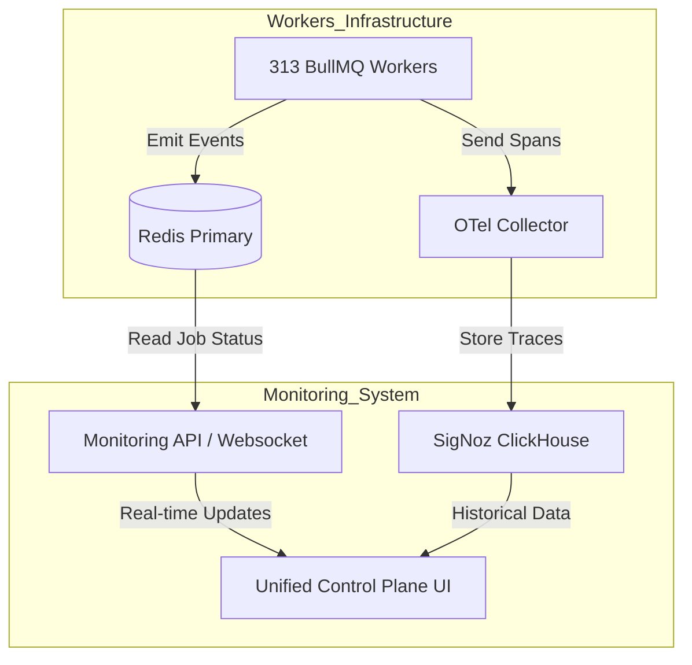

# PROIECTARE SISTEM MONITORIZARE UNIFICATĂ UI/UX (300+ WORKERI)

**Versiune:** 1.0  
**Data:** 20 Ianuarie 2026  
**Focus:** Control Plane & Observability pentru 313 BullMQ Workers  
**Paradigma:** Monitorizare "Human-Centric" pentru 1-Person-Team

---

## 1. VIZIUNE ȘI OBIECTIVE

Gestionarea a **313 workeri distribuiți** necesită o schimbare de paradigmă de la "Logging pasiv" la "Observability activ". Nu este suficient să avem loguri; avem nevoie de un **Control Plane** vizual care să permită operatorului uman să înțeleagă "pulsul" sistemului dintr-o privire și să intervină chirurgical.

### Obiective Cheie

1. **Vizibilitate Totală (Single Pane of Glass):** O singură interfață pentru starea tuturor celor 5 etape.
2. **Control Operațional:** Butoane de `Pause`, `Resume`, `Retry Failed`, `Purge Queue` direct din UI.
3. **Corelare Vizuală:** Urmărirea unui `lead_id` prin toate cele 5 etape (Trace View).
4. **Debugging Contextual:** Când un worker eșuează, UI-ul trebuie să arate input-ul, eroarea stack-trace și contextul logic, cu buton de "Fix & Retry".

---

## 2. ARHITECTURĂ TEHNICĂ: "THE OBSERVABILITY SIDECAR"

Sistemul de monitorizare nu va fi invaziv în codul de business. Va rula ca un strat paralel ("Sidecar Architecture").

### Stack Tehnologic

| Componentă | Tehnologie | Rol |
| ---------- | ---------- | --- |
| **Backend Agregator** | **Fastify + BullMQ API** | Expune starea cozilor Redis prin WebSocket/SSE către UI. |
| **Metrics Store** | **Redis Timeseries + SigNoz** | Stocare metrici high-resolution (throughput, latency). |
| **Frontend UI** | **React 19 + Refine + Recharts** | Dashboard interactiv, parte din `admin-panel`. |
| **Tracing** | **OpenTelemetry (Auto-instrumentation)** | Urmărire flow end-to-end prin `correlation_id`. |
| **Alerting** | **SigNoz Alerts** | Notificări inteligente (nu spam) pe Slack/Discord. |

### Diagrama Flux Monitorizare

---

## 3. IMPLEMENTARE GRADUALĂ (ETAPA 0 → 5)

Abordarea este "Monitoring-First Development". Nu implementăm un worker până nu avem dashboard-ul pregătit pentru el.

### 🟡 ETAPA 0: Fundația Infrastructurii (Monitoring Skeleton)

**Obiectiv:** Setup pipeline de colectare date.

1. **Implementare `libs/observability`:** Pachet partajat care configurează OpenTelemetry auto-instrumentation pentru orice worker nou.
2. **Deploy SigNoz & Redis Metrics:** Setup containere docker dedicate monitorizării (separat de app logic).
3. **Dashboard "System Health":** CPU/RAM server, Redis Memory, PostgreSQL Connections (Vizualizare globală resurse).

### 🟢 ETAPA 1: "Data Pipeline Dashboard" (Vizualizare Flux)

**Focus:** Vizualizarea transformării datelor (Bronze → Silver).

1. **UI Component: Pipeline Flow:** Grafic vizual (Sankey Diagram) care arată câți prospecți intră în Bronze și câți ajung în Silver.
2. **Worker Detail View:** Pentru fiecare din cei 58 workeri de enrichment, vizualizare:
    * Joburi procesate/minut.
    * Rata de succes API (ANAF, Termene).
    * Cost per request (pentru API-uri plătite).
3. **Traceability:** Căutare după CUI -> Arată tot istoricul de enrichment.

### 🔵 ETAPA 2: "Outreach Control Room" (Mission Control)

**Focus:** Monitorizare comunicare în timp real.

1. **Live Feed UI:** O coloană "Matrix-style" cu ultimele mesaje trimise/primite pe WhatsApp și Email.
2. **Rate Limit Gauges:** Vitezometre vizuale pentru limitele WhatsApp/Email (ex. "Phone 1: 85% din limita orară").
3. **Emergency Stop:** Buton global "PAUSE OUTREACH" care oprește instant toți cei 52 workeri de comunicare.

### 🟣 ETAPA 3: "AI Agent Thought Explorer" (Debugging Cognitiv)

**Focus:** Înțelegerea "gândirii" AI-ului.

1. **Reasoning Timeline:** Vizualizare pas-cu-pas a deciziilor agentului (Step 1: Search, Step 2: Filter, Step 3: Reply).
2. **Token Cost Monitor:** Grafic în timp real cu consumul de tokeni și costul ($) acumulat per tenant.
3. **Hallucination Alert:** Listă roșie cu intervențiile Guardrails (când AI-ul a vrut să facă ceva greșit și a fost blocat).

### 🟠 ETAPA 4: "Financial Pulse" (Trz & Facturi)

1. **Invoice Tracker:** Kanban board automat cu starea fiecărei facturi (Generată -> Trimisă SPV -> Validată ANAF).
2. **SLA Countdown:** Timer vizual pentru termenul de 5 zile e-Factura.

### 🔴 ETAPA 5: "Ecosystem Graph" (Geo & Network)

1. **Live Map:** Hartă Leaflet/Mapbox cu pin-uri care se aprind în timp real când un worker procesează o fermă.
2. **Network Density:** Heatmap cu activitatea workerilor pe regiuni geografice.

---

## 4. UI/UX DESIGN SPECS (User-Friendly)

Interfața nu trebuie să arate a "tool de admin vechi", ci a "Cockpit de Navă Spațială".

1. **Dark Mode Default:** Pentru reducerea oboselii ochilor (Cyberpunk Aesthetics).
2. **Status Colors:**
    * 🟢 **Pulsating Green:** Worker activ, procesează normal.
    * 🟡 **Yellow Static:** Worker în idle / așteptare rate limits.
    * 🔴 **Flashing Red:** Eroare critică / Worker blocat.
    * Wait/Blocked: Gri.
3. **Micro-Animations:** Barele de progres se mișcă real, contoarele se incrementează animat.
4. **Game-like HUD:** Heads-Up Display pentru metrici critice (Erori, Bani cheltuiți, Lead-uri convertite) mereu vizibil sus.

---

## 5. PLAN DE ACȚIUNE IMEDIAT (NEXT STEPS)

1. Actualizare `specifications/Etapa 0/etapa0-plan-implementare-complet-v2.md` cu aceste noi cerințe.
2. Crearea specificației tehnice detaliate pentru componenta `monitoring-api` (Fastify plugin).
3. Definirea JSON Schema pentru logurile structurate care vor alimenta acest UI.
