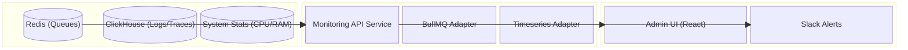

# TECHNICAL SPECIFICATION: MONITORING API (SIDECAR)

**Document Status:** NORMATIV 1.1  
**Data:** 1 Februarie 2026  
**Componenta:** `apps/monitoring-api`

---

## 1. VISION & PURPOSE

Serviciul `monitoring-api` funcționează ca un **Observability Sidecar** pentru infrastructura Cerniq. Scopul său este să agrege date de stare în timp real (Redis Queues, System Metrics, Error Rates) și să le expună către Admin Dashboard prin WebSocket, **fără a impacta performanța API-ului principal de business**.

### Core Architecture Principles

1. **Read-Only Operations:** Serviciul nu modifică starea business-ului, doar citește metrics.
2. **Separate Event Loop:** Rulează izolat de `apps/api` pentru a garanta disponibilitatea dashboard-ului chiar dacă API-ul principal este sub load.
3. **Real-Time Push:** Utilizează WebSockets pentru a trimite updates către UI, evitând polling-ul agresiv.

---

## 2. TECHNOLOGY STACK

* **Runtime:** Node.js v24 (LTS)
* **Framework:** Fastify v5.x
* **Queue Interface:** BullMQ (Read-Only wrappers)
* **Real-Time:** `@fastify/websocket`
* **Metrics Storage:** Redis Timeseries (pentru agregate simple) + Query direct către SigNoz (ClickHouse) via API.
* **Log Aggregation:** OpenTelemetry Auto-Instrumentation.

---

## 3. ARCHITECTURE DIAGRAM



---

## 4. API ENDPOINTS

### 4.1 REST Endpoints

| Method | Endpoint | Description |
| :--- | :--- | :--- |
| `GET` | `/health` | Service health check |
| `GET` | `/api/queues` | Lista sumară a tuturor cozilor active |
| `GET` | `/api/queues/:name` | Detalii specifice pentru o coadă (jobs counts) |
| `GET` | `/api/system/metrics` | Agregate curente (CPU load, Memory usage) |
| `POST` | `/api/control/pause` | (Protected) Emergency Stop pentru o coadă |

### 4.2 WebSocket Events (`/ws/live`)

Protocol: JSON-RPC style messages over WS.

**Server -> Client (Push):**

```json
{
  "type": "METRIC_UPDATE",
  "payload": {
    "timestamp": 1705312345678,
    "queues": {
      "enrichment-worker": {
        "waiting": 12,
        "active": 5,
        "failed": 0,
        "throughput": 45 // jobs/min
      }
    },
    "system": {
      "cpuPercent": 45.2,
      "memoryUsageMB": 1024
    }
  }
}
```

---

## 5. DATA MODEL & SCHEMA

### QueueMetric Schema (Zod)

```typescript
import { z } from 'zod';

export const QueueMetricSchema = z.object({
  queueName: z.string(),
  counts: z.object({
    waiting: z.number().int(),
    active: z.number().int(),
    completed: z.number().int(),
    failed: z.number().int(),
    delayed: z.number().int()
  }),
  throughput: z.number().describe('Jobs processed per minute (last 5 min avg)'),
  latency: z.number().describe('Average job duration in ms')
});
```

---

## 6. IMPLEMENTATION DETAILS

### 6.1 BullMQ Integration

Vom refolosi conexiunea Redis definită în variabilele de mediu, dar vom instanția `Queue` objects în mod **read-only** (fără a defini processori).

```typescript
// src/services/queue-monitor.ts
import { Queue } from 'bullmq';
import { connection } from '../infra/redis';

const monitoredQueues = [
  new Queue('enrichment', { connection }),
  new Queue('outreach', { connection }),
  // ...
];

export async function gatherMetrics() {
  const metrics = await Promise.all(monitoredQueues.map(async (q) => {
    const counts = await q.getJobCounts();
    return { name: q.name, counts };
  }));
  return metrics;
}
```

### 6.2 WebSocket Broadcast Loop

Monitoring API va avea un interval (ex: 2 secunde) în care colectează metrici și le trimite către toți clienții conectați.

```typescript
// src/plugins/websocket.ts
setInterval(async () => {
  const metrics = await metricsService.gatherAll();
  const message = JSON.stringify({ type: 'METRIC_UPDATE', payload: metrics });
  
  fastify.websocketServer.clients.forEach(client => {
    if (client.readyState === 1) client.send(message);
  });
}, 2000);
```

---

## 7. SECURITY

* Accesul la `monitoring-api` va fi protejat prin **Internal VPC Restrictions** (accesibil doar din rețeaua internă sau prin VPN/Admin interface).
* Endpoint-urile de control (ex: Pause/Resume) necesită header `x-admin-key`.

---

## 8. CONFIGURARE & ENV VARS

| Variabilă | Descriere | Exemplu |
| :--- | :--- | :--- |
| `PORT` | Port server | `64000` |
| `REDIS_HOST` | Redis host | `redis` |
| `REDIS_PORT` | Redis port | `6379` |
| `MONITORING_POLL_INTERVAL_MS` | Interval polling (ms) | `2000` |
| `ADMIN_KEY` | Cheie admin pentru control | `change_me` |

---

## 9. OPERAȚIONAL

### 9.1 Rate & Load Guidelines

- Polling interval recomandat: **>= 2000 ms**
- Evitați instrumentarea directă a queue depth în workers (reduce Redis load)

### 9.2 Failure Modes

| Simptom | Cauză probabilă | Remediere |
| --- | --- | --- |
| `/api/queues` timeout | Redis down | Verificați Redis + restart `monitoring-api` |
| WS disconnects | Network/VPC issue | Verificați firewall/VPN |
| Empty metrics | Poll interval prea mare | Reduceți `MONITORING_POLL_INTERVAL_MS` |

---

## 10. COMPLIANCE

- Read-only access la Redis
- Fără PII în payload-urile WebSocket
- Acces restricționat la rețeaua internă

---
