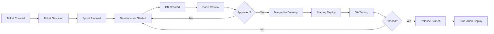

# Etapa 3 - Proceduri și Workflow-uri de Dezvoltare
## AI Sales Agent - Development Procedures, Release Process și Operational Workflows

**Versiune:** 1.0.0
**Ultima actualizare:** 2026-01-19
**Autor:** Cerniq Development Team
**Clasificare:** Document Tehnic Intern

---

## Cuprins

1. [Introducere și Scopul Procedurilor](#1-introducere-și-scopul-procedurilor)
2. [Proceduri de Dezvoltare](#2-proceduri-de-dezvoltare)
3. [Workflow de Feature Development](#3-workflow-de-feature-development)
4. [Proceduri de Code Review](#4-proceduri-de-code-review)
5. [Proceduri de Testing](#5-proceduri-de-testing)
6. [Proceduri de Release](#6-proceduri-de-release)
7. [Proceduri de Deployment](#7-proceduri-de-deployment)
8. [Proceduri de Hotfix](#8-proceduri-de-hotfix)
9. [Proceduri de Rollback](#9-proceduri-de-rollback)
10. [Proceduri de Database Migration](#10-proceduri-de-database-migration)
11. [Proceduri de Incident Response](#11-proceduri-de-incident-response)
12. [Proceduri de On-Call](#12-proceduri-de-on-call)
13. [Proceduri de Comunicare](#13-proceduri-de-comunicare)
14. [Proceduri de Documentație](#14-proceduri-de-documentație)
15. [Anexe și Templates](#15-anexe-și-templates)

---

## 1. Introducere și Scopul Procedurilor

### 1.1 Scopul Documentului

Acest document definește procedurile și workflow-urile standard pentru dezvoltarea, testarea, și deployment-ul componentelor Etapa 3 (AI Sales Agent) ale platformei Cerniq.

### 1.2 Audiența Țintă

- Dezvoltatori Frontend și Backend
- DevOps Engineers
- Tech Leads
- Product Managers
- QA Engineers

### 1.3 Principii Directoare

```yaml
principii:
  quality_first:
    description: "Calitatea are prioritate asupra vitezei"
    implicații:
      - Code review obligatoriu
      - Teste automate pentru orice cod nou
      - Zero tolerance pentru regression bugs
      
  automation:
    description: "Automatizează tot ce poate fi automatizat"
    implicații:
      - CI/CD pentru toate proiectele
      - Teste automate
      - Deployment automat
      
  transparency:
    description: "Transparență completă în proces"
    implicații:
      - Status updates în Slack
      - Documentație publică
      - Metrics accesibile
      
  continuous_improvement:
    description: "Îmbunătățire continuă"
    implicații:
      - Retrospective regulate
      - Post-mortem pentru incidente
      - Feedback loops
```

---

## 2. Proceduri de Dezvoltare

### 2.1 Setup Environment

```bash
#!/bin/bash
# setup-dev-environment.sh
# Scriptul de setup pentru un nou dezvoltator

echo "=== Cerniq Development Environment Setup ==="

# 1. Verifică prerequisite
check_prerequisites() {
    echo "Verificare prerequisite..."
    
    # Node.js v24+
    if ! command -v node &> /dev/null || [[ $(node -v | cut -d'v' -f2 | cut -d'.' -f1) -lt 24 ]]; then
        echo "❌ Node.js v24+ required"
        exit 1
    fi
    echo "✅ Node.js $(node -v)"
    
    # Docker
    if ! command -v docker &> /dev/null; then
        echo "❌ Docker required"
        exit 1
    fi
    echo "✅ Docker $(docker --version)"
    
    # Git
    if ! command -v git &> /dev/null; then
        echo "❌ Git required"
        exit 1
    fi
    echo "✅ Git $(git --version)"
}

# 2. Clone repository
clone_repo() {
    echo "Clonare repository..."
    git clone git@github.com:cerniq/cerniq-app.git
    cd cerniq-app
    git checkout develop
}

# 3. Install dependencies
install_deps() {
    echo "Instalare dependențe..."
    npm ci
}

# 4. Setup local environment
setup_env() {
    echo "Configurare environment local..."
    cp .env.example .env.local
    
    echo "Editează .env.local cu credențialele locale"
}

# 5. Start local services
start_services() {
    echo "Pornire servicii locale..."
    docker compose -f docker-compose.dev.yml up -d
    
    # Wait for services
    echo "Așteptare pornire servicii..."
    sleep 10
    
    # Run migrations
    npm run db:migrate
    
    # Seed development data
    npm run db:seed
}

# 6. Verify setup
verify_setup() {
    echo "Verificare setup..."
    npm run test:unit -- --run
    
    if [ $? -eq 0 ]; then
        echo "✅ Setup complet!"
        echo ""
        echo "Comenzi utile:"
        echo "  npm run dev          - Start development server"
        echo "  npm run test:watch   - Run tests in watch mode"
        echo "  npm run db:studio    - Open Drizzle Studio"
    else
        echo "❌ Setup failed. Verifică erorile."
    fi
}

# Run
check_prerequisites
clone_repo
install_deps
setup_env
start_services
verify_setup
```

### 2.2 Daily Development Workflow

```markdown
## Daily Development Workflow

### Start of Day (08:00 - 08:30)
1. Pull latest changes
   ```bash
   git checkout develop
   git pull origin develop
   ```

2. Check CI status
   - Review overnight build failures
   - Check for any blocked PRs

3. Review assigned tickets
   - Check Jira board for priorities
   - Review any overnight comments on PRs

### Development (08:30 - 12:00)
1. Create feature branch
   ```bash
   git checkout -b feature/CERN-XXX-description
   ```

2. Implement with TDD cycle
   - Write failing test
   - Implement minimal code
   - Refactor
   - Repeat

3. Commit frequently
   ```bash
   git add -p  # Review changes
   git commit -m "feat(scope): description"
   ```

### Lunch Break (12:00 - 13:00)

### Afternoon Development (13:00 - 17:00)
1. Continue implementation
2. Push WIP branch for backup
   ```bash
   git push -u origin feature/CERN-XXX-description
   ```

3. Create Draft PR if continuing next day

### End of Day (17:00 - 17:30)
1. Push all changes
2. Update ticket status
3. Document any blockers
4. Handoff notes if needed
```

### 2.3 Local Development Commands

```bash
# Development server
npm run dev                     # Start all services
npm run dev:api                 # Start API only
npm run dev:web                 # Start frontend only
npm run dev:workers             # Start workers only

# Database
npm run db:migrate              # Run migrations
npm run db:migrate:rollback     # Rollback last migration
npm run db:seed                 # Seed development data
npm run db:reset                # Drop, create, migrate, seed
npm run db:studio               # Open Drizzle Studio

# Testing
npm run test                    # Run all tests
npm run test:unit               # Run unit tests
npm run test:integration        # Run integration tests
npm run test:e2e                # Run E2E tests
npm run test:watch              # Watch mode
npm run test:coverage           # With coverage

# Code quality
npm run lint                    # Run ESLint
npm run lint:fix                # Fix auto-fixable issues
npm run typecheck               # TypeScript check
npm run format                  # Format with Prettier
npm run format:check            # Check formatting

# Build
npm run build                   # Build all packages
npm run build:api               # Build API
npm run build:web               # Build frontend
```

---

## 3. Workflow de Feature Development

### 3.1 Feature Lifecycle



### 3.2 Ticket Workflow

```yaml
ticket_states:
  - name: BACKLOG
    description: "Ticket creat, neprioretizat"
    actions:
      - Grooming meeting
      - Prioritization
    
  - name: READY_FOR_DEV
    description: "Ticket groom-uit, estimat, prioritizat"
    requirements:
      - Acceptance criteria definite
      - Technical approach discussed
      - Dependencies identified
      - Estimate provided (story points)
    
  - name: IN_PROGRESS
    description: "Dezvoltare activă"
    actions:
      - Create branch
      - Implement solution
      - Write tests
    
  - name: CODE_REVIEW
    description: "PR creat, în review"
    requirements:
      - All tests passing
      - Code coverage met
      - Self-review completed
    
  - name: QA
    description: "Testing pe staging"
    actions:
      - Manual testing
      - Regression testing
      - Performance testing (if applicable)
    
  - name: DONE
    description: "Deployed to production, verified"
    requirements:
      - Production deployment successful
      - Monitoring shows no issues
      - PO acceptance
```

### 3.3 Feature Development Checklist

```markdown
## Feature Development Checklist

### Before Starting
- [ ] Ticket is in READY_FOR_DEV status
- [ ] Acceptance criteria are clear
- [ ] Technical approach is agreed
- [ ] Dependencies are resolved
- [ ] Branch created from latest develop

### During Development
- [ ] Follow TDD when possible
- [ ] Commit frequently with meaningful messages
- [ ] Update tests for any behavior changes
- [ ] Document any deviations from plan
- [ ] Keep PR scope focused

### Before Creating PR
- [ ] All tests pass locally
- [ ] Code is linted and formatted
- [ ] Self-review completed
- [ ] Documentation updated if needed
- [ ] Changelog updated if user-facing

### PR Created
- [ ] Title follows convention
- [ ] Description is complete
- [ ] Linked to ticket
- [ ] Requested appropriate reviewers
- [ ] Added relevant labels

### After Merge
- [ ] Verify staging deployment
- [ ] Update ticket status
- [ ] Notify QA if needed
- [ ] Monitor for issues
```

---

## 4. Proceduri de Code Review

### 4.1 Review Assignment

```yaml
review_assignment:
  auto_assignment:
    enabled: true
    min_reviewers: 2
    rules:
      - path: "packages/api/**"
        teams: ["backend-team"]
      - path: "packages/web/**"
        teams: ["frontend-team"]
      - path: "packages/workers/**"
        teams: ["backend-team"]
      - path: "packages/shared/**"
        teams: ["backend-team", "frontend-team"]
        
  required_approvals:
    default: 2
    critical_paths:
      - path: "packages/api/src/services/**"
        approvals: 2
        required_reviewers: ["@tech-lead"]
      - path: "**/security/**"
        approvals: 2
        required_reviewers: ["@security-champion"]
      - path: "**/migrations/**"
        approvals: 2
        required_reviewers: ["@dba"]
```

### 4.2 Review SLAs

```yaml
review_sla:
  initial_review:
    target: "4 hours"
    max: "1 business day"
    
  follow_up_review:
    target: "2 hours"
    max: "4 hours"
    
  escalation:
    - after: "4 hours"
      action: "Reminder în Slack"
    - after: "8 hours"
      action: "Escalare la Tech Lead"
    - after: "24 hours"
      action: "Escalare la Engineering Manager"
```

### 4.3 Review Process

```markdown
## Code Review Process

### Reviewer Responsibilities

1. **Initial Scan** (5 min)
   - Read PR description
   - Understand scope and context
   - Check for obvious issues

2. **Detailed Review** (15-30 min)
   - Review code changes line by line
   - Check for:
     - Logic errors
     - Security issues
     - Performance problems
     - Missing tests
     - Code style violations

3. **Test the Changes** (optional but recommended)
   - Checkout branch
   - Run tests locally
   - Manual testing if applicable

4. **Provide Feedback**
   - Use appropriate feedback categories
   - Be constructive and specific
   - Suggest solutions, not just problems

### Author Responsibilities

1. **Respond to All Comments**
   - Acknowledge with reaction or reply
   - Explain decisions if disagreeing
   - Make requested changes

2. **Keep PR Updated**
   - Rebase if develop has changed
   - Push fixes in separate commits
   - Mark conversations as resolved

3. **Request Re-review**
   - After addressing feedback
   - Tag reviewers explicitly
```

### 4.4 Review Automation

```yaml
# .github/workflows/pr-checks.yml
name: PR Checks

on:
  pull_request:
    types: [opened, synchronize, reopened]

jobs:
  lint:
    runs-on: ubuntu-latest
    steps:
      - uses: actions/checkout@v4
      - uses: actions/setup-node@v4
        with:
          node-version: '24'
      - run: npm ci
      - run: npm run lint
      
  typecheck:
    runs-on: ubuntu-latest
    steps:
      - uses: actions/checkout@v4
      - uses: actions/setup-node@v4
      - run: npm ci
      - run: npm run typecheck
      
  test:
    runs-on: ubuntu-latest
    services:
      postgres:
        image: postgres:18
        env:
          POSTGRES_PASSWORD: test
        ports:
          - 64032:64032
      redis:
        image: redis:7
        ports:
          - 64039:64039
    steps:
      - uses: actions/checkout@v4
      - uses: actions/setup-node@v4
      - run: npm ci
      - run: npm run test:coverage
      - uses: codecov/codecov-action@v4
      
  security:
    runs-on: ubuntu-latest
    steps:
      - uses: actions/checkout@v4
      - name: Run Snyk
        uses: snyk/actions/node@master
        env:
          SNYK_TOKEN: ${{ secrets.SNYK_TOKEN }}
```

---

## 5. Proceduri de Testing

### 5.1 Testing Strategy per Feature

```yaml
testing_requirements:
  new_feature:
    unit_tests:
      required: true
      coverage: "80%"
    integration_tests:
      required: true
      scope: "happy path + error cases"
    e2e_tests:
      required: "for user-facing features"
    
  bug_fix:
    unit_tests:
      required: true
      scope: "test that reproduces bug + fix verification"
    regression_tests:
      required: "if affects existing functionality"
    
  refactoring:
    unit_tests:
      required: "all existing tests must pass"
    additional_tests:
      required: "only if uncovering untested code"
```

### 5.2 Test Execution Workflow

```bash
#!/bin/bash
# run-tests.sh - Complete test execution

echo "=== Running Complete Test Suite ==="

# 1. Unit Tests
echo ""
echo "📦 Running Unit Tests..."
npm run test:unit
UNIT_EXIT=$?

# 2. Integration Tests
echo ""
echo "🔗 Running Integration Tests..."
npm run test:integration
INTEGRATION_EXIT=$?

# 3. E2E Tests (if applicable)
if [ "$RUN_E2E" = "true" ]; then
    echo ""
    echo "🌐 Running E2E Tests..."
    npm run test:e2e
    E2E_EXIT=$?
else
    E2E_EXIT=0
fi

# 4. Generate Coverage Report
echo ""
echo "📊 Generating Coverage Report..."
npm run test:coverage -- --reporter=json

# 5. Check Coverage Thresholds
echo ""
echo "📈 Checking Coverage Thresholds..."
npx nyc check-coverage \
    --lines 80 \
    --branches 75 \
    --functions 80 \
    --statements 80

COVERAGE_EXIT=$?

# Summary
echo ""
echo "=== Test Summary ==="
echo "Unit Tests:        $([ $UNIT_EXIT -eq 0 ] && echo '✅ PASS' || echo '❌ FAIL')"
echo "Integration Tests: $([ $INTEGRATION_EXIT -eq 0 ] && echo '✅ PASS' || echo '❌ FAIL')"
echo "E2E Tests:         $([ $E2E_EXIT -eq 0 ] && echo '✅ PASS' || echo '❌ FAIL')"
echo "Coverage:          $([ $COVERAGE_EXIT -eq 0 ] && echo '✅ PASS' || echo '❌ FAIL')"

# Exit with failure if any failed
if [ $UNIT_EXIT -ne 0 ] || [ $INTEGRATION_EXIT -ne 0 ] || [ $E2E_EXIT -ne 0 ] || [ $COVERAGE_EXIT -ne 0 ]; then
    exit 1
fi

echo ""
echo "✅ All tests passed!"
```

### 5.3 QA Testing Checklist

```markdown
## QA Testing Checklist

### Functional Testing
- [ ] All acceptance criteria met
- [ ] Happy path works correctly
- [ ] Edge cases handled
- [ ] Error messages are user-friendly
- [ ] Data validation works

### Cross-Browser Testing (Frontend)
- [ ] Chrome (latest)
- [ ] Firefox (latest)
- [ ] Safari (latest)
- [ ] Edge (latest)

### Responsive Testing (Frontend)
- [ ] Desktop (1920x1080)
- [ ] Laptop (1366x768)
- [ ] Tablet (768x1024)
- [ ] Mobile (375x812)

### Performance Testing
- [ ] Page load < 3 seconds
- [ ] API response < 500ms
- [ ] No memory leaks
- [ ] No excessive network requests

### Security Testing
- [ ] No sensitive data in logs
- [ ] Authentication working
- [ ] Authorization correct
- [ ] Input validation

### Accessibility Testing
- [ ] Keyboard navigation
- [ ] Screen reader compatible
- [ ] Color contrast adequate
- [ ] ARIA labels present

### Regression Testing
- [ ] Related features still work
- [ ] No new console errors
- [ ] Existing tests pass
```

---

## 6. Proceduri de Release

### 6.1 Release Schedule

```yaml
release_schedule:
  regular_releases:
    frequency: "bi-weekly"
    day: "Tuesday"
    time: "10:00 UTC"
    
  hotfixes:
    frequency: "as needed"
    max_time_to_production: "4 hours"
    
  feature_flags:
    enabled: true
    gradual_rollout: true
```

### 6.2 Release Process

```markdown
## Release Process

### T-3 Days: Release Planning
1. Create release branch from develop
   ```bash
   git checkout develop
   git pull origin develop
   git checkout -b release/v1.X.0
   ```

2. Update version numbers
   ```bash
   npm version minor  # or patch/major
   ```

3. Update CHANGELOG.md
   - List all changes since last release
   - Categorize by type (Features, Fixes, etc.)
   - Highlight breaking changes

4. Create Release PR
   - From release/v1.X.0 to main
   - Request reviews from Tech Lead and QA Lead

### T-2 Days: Release Testing
1. Deploy to staging
2. Run full regression suite
3. QA manual testing
4. Security scan
5. Performance testing

### T-1 Day: Release Preparation
1. Final PR approval
2. Prepare deployment checklist
3. Notify stakeholders
4. Schedule deployment window

### Release Day
1. Final staging verification
2. Merge to main
3. Tag release
   ```bash
   git tag -a v1.X.0 -m "Release v1.X.0"
   git push origin v1.X.0
   ```
4. Production deployment
5. Smoke testing
6. Merge main back to develop
7. Announce release
```

### 6.3 Release Checklist

```markdown
## Release Checklist

### Pre-Release
- [ ] All PRs merged to release branch
- [ ] All tests passing on release branch
- [ ] Version numbers updated
- [ ] CHANGELOG.md updated
- [ ] Documentation updated
- [ ] Release notes drafted
- [ ] Database migrations tested
- [ ] Rollback plan documented

### Release Approval
- [ ] Tech Lead approval
- [ ] QA Lead approval
- [ ] Product Owner approval (for major releases)

### Deployment
- [ ] Maintenance window announced
- [ ] Backup created
- [ ] Deployment executed
- [ ] Smoke tests passed
- [ ] Monitoring shows healthy

### Post-Release
- [ ] Merge to main completed
- [ ] Tag created and pushed
- [ ] Merge back to develop
- [ ] Release notes published
- [ ] Stakeholders notified
- [ ] Metrics baseline updated
```

---

## 7. Proceduri de Deployment

### 7.1 Deployment Environments

```yaml
environments:
  development:
    purpose: "Local development"
    access: "All developers"
    data: "Mock/seed data"
    refresh: "On-demand"
    
  staging:
    purpose: "Pre-production testing"
    access: "All team members"
    data: "Anonymized production clone"
    refresh: "Weekly"
    url: "https://staging.cerniq.app"
    
  production:
    purpose: "Live system"
    access: "Restricted (DevOps + Leads)"
    data: "Real data"
    refresh: "N/A"
    url: "https://app.cerniq.app"
```

### 7.2 Deployment Procedure

```bash
#!/bin/bash
# deploy.sh <environment>

ENVIRONMENT=$1
VERSION=${2:-"latest"}

echo "=== Deployment to $ENVIRONMENT ==="
echo "Version: $VERSION"
echo "Time: $(date)"

# Validation
validate_deployment() {
    # Check environment
    if [[ ! "$ENVIRONMENT" =~ ^(staging|production)$ ]]; then
        echo "❌ Invalid environment: $ENVIRONMENT"
        exit 1
    fi
    
    # Production requires explicit confirmation
    if [ "$ENVIRONMENT" = "production" ]; then
        echo ""
        echo "⚠️  PRODUCTION DEPLOYMENT"
        echo "Type 'DEPLOY PRODUCTION' to continue:"
        read confirmation
        if [ "$confirmation" != "DEPLOY PRODUCTION" ]; then
            echo "❌ Deployment cancelled"
            exit 1
        fi
    fi
}

# Pre-deployment checks
pre_deployment_checks() {
    echo ""
    echo "📋 Pre-deployment checks..."
    
    # Check CI status
    echo "  Checking CI status..."
    CI_STATUS=$(gh run list --limit 1 --json conclusion -q '.[0].conclusion')
    if [ "$CI_STATUS" != "success" ]; then
        echo "  ❌ CI not passing"
        exit 1
    fi
    echo "  ✅ CI passing"
    
    # Check disk space
    echo "  Checking disk space..."
    DISK_USAGE=$(ssh $ENVIRONMENT "df -h / | tail -1 | awk '{print \$5}' | tr -d '%'")
    if [ "$DISK_USAGE" -gt 80 ]; then
        echo "  ⚠️  Disk usage high: $DISK_USAGE%"
    fi
    echo "  ✅ Disk space OK"
    
    # Check service health
    echo "  Checking service health..."
    HEALTH=$(curl -s https://$ENVIRONMENT.cerniq.app/health | jq -r '.status')
    if [ "$HEALTH" != "ok" ]; then
        echo "  ⚠️  Service not healthy: $HEALTH"
    fi
    echo "  ✅ Services healthy"
}

# Create backup
create_backup() {
    echo ""
    echo "💾 Creating backup..."
    ssh $ENVIRONMENT "cd /opt/cerniq && ./scripts/backup.sh pre-deploy"
    echo "  ✅ Backup created"
}

# Deploy
deploy() {
    echo ""
    echo "🚀 Deploying..."
    
    # Pull latest images
    echo "  Pulling images..."
    ssh $ENVIRONMENT "cd /opt/cerniq && docker compose pull"
    
    # Run migrations
    echo "  Running migrations..."
    ssh $ENVIRONMENT "cd /opt/cerniq && docker compose run --rm api npm run db:migrate"
    
    # Rolling update
    echo "  Rolling update..."
    ssh $ENVIRONMENT "cd /opt/cerniq && docker compose up -d --no-deps --scale api=2 api"
    sleep 10
    ssh $ENVIRONMENT "cd /opt/cerniq && docker compose up -d --no-deps --scale api=1 api"
    
    # Update other services
    ssh $ENVIRONMENT "cd /opt/cerniq && docker compose up -d"
    
    echo "  ✅ Deployment complete"
}

# Post-deployment verification
post_deployment_verification() {
    echo ""
    echo "✔️  Post-deployment verification..."
    
    # Health check
    echo "  Health check..."
    for i in {1..5}; do
        HEALTH=$(curl -s https://$ENVIRONMENT.cerniq.app/health | jq -r '.status')
        if [ "$HEALTH" = "ok" ]; then
            echo "  ✅ Health check passed"
            break
        fi
        echo "  Waiting... ($i/5)"
        sleep 5
    done
    
    # Smoke tests
    echo "  Running smoke tests..."
    npm run test:smoke -- --env=$ENVIRONMENT
    
    echo "  ✅ Verification complete"
}

# Notify
notify_deployment() {
    echo ""
    echo "📢 Notifying..."
    
    # Slack notification
    curl -X POST "$SLACK_WEBHOOK" \
        -H 'Content-Type: application/json' \
        -d "{
            \"text\": \"✅ Deployment to $ENVIRONMENT completed\",
            \"attachments\": [{
                \"color\": \"good\",
                \"fields\": [
                    {\"title\": \"Version\", \"value\": \"$VERSION\", \"short\": true},
                    {\"title\": \"Environment\", \"value\": \"$ENVIRONMENT\", \"short\": true},
                    {\"title\": \"Deployed by\", \"value\": \"$(whoami)\", \"short\": true},
                    {\"title\": \"Time\", \"value\": \"$(date)\", \"short\": true}
                ]
            }]
        }"
    
    echo "  ✅ Notifications sent"
}

# Main
validate_deployment
pre_deployment_checks
create_backup
deploy
post_deployment_verification
notify_deployment

echo ""
echo "=== Deployment Complete ==="
```

### 7.3 Blue-Green Deployment

```bash
#!/bin/bash
# blue-green-deploy.sh

# Determine current active environment
ACTIVE=$(cat /opt/cerniq/active-env)  # "blue" or "green"
INACTIVE=$([ "$ACTIVE" = "blue" ] && echo "green" || echo "blue")

echo "Current active: $ACTIVE"
echo "Deploying to: $INACTIVE"

# Deploy to inactive environment
echo "Deploying to $INACTIVE..."
docker compose -f docker-compose.$INACTIVE.yml pull
docker compose -f docker-compose.$INACTIVE.yml up -d

# Wait for health
echo "Waiting for $INACTIVE to be healthy..."
for i in {1..30}; do
    HEALTH_PORT=$([[ "$INACTIVE" = "blue" ]] && echo "64001" || echo "64002")
    HEALTH=$(curl -s http://localhost:${HEALTH_PORT}/health | jq -r '.status')
    if [ "$HEALTH" = "ok" ]; then
        echo "$INACTIVE is healthy!"
        break
    fi
    echo "Waiting... ($i/30)"
    sleep 2
done

# Run smoke tests on inactive
echo "Running smoke tests on $INACTIVE..."
npm run test:smoke -- --port=$([[ "$INACTIVE" = "blue" ]] && echo "64001" || echo "64002")

if [ $? -ne 0 ]; then
    echo "❌ Smoke tests failed. Aborting switch."
    exit 1
fi

# Switch traffic (update Traefik config)
echo "Switching traffic to $INACTIVE..."
cat > /opt/cerniq/traefik/dynamic/active.yml << EOF
http:
  routers:
    cerniq-app:
      rule: "Host(\`app.cerniq.app\`)"
      service: cerniq-$INACTIVE
      tls:
        certResolver: letsencrypt
EOF

# Update active marker
echo "$INACTIVE" > /opt/cerniq/active-env

# Verify switch
sleep 5
PROD_HEALTH=$(curl -s https://app.cerniq.app/health | jq -r '.status')
if [ "$PROD_HEALTH" = "ok" ]; then
    echo "✅ Traffic switched to $INACTIVE"
else
    echo "❌ Health check failed after switch. Rolling back..."
    echo "$ACTIVE" > /opt/cerniq/active-env
    # Restore Traefik config
    exit 1
fi

# Stop old environment (optional, keep for quick rollback)
echo "Keeping $ACTIVE running for quick rollback"
echo "To stop: docker compose -f docker-compose.$ACTIVE.yml down"
```

---

## 8. Proceduri de Hotfix

### 8.1 Hotfix Criteria

```yaml
hotfix_criteria:
  security:
    priority: CRITICAL
    sla: "2 hours to fix, 4 hours to deploy"
    examples:
      - "Authentication bypass"
      - "Data exposure vulnerability"
      - "SQL injection"
      
  data_loss:
    priority: CRITICAL
    sla: "2 hours to fix, 4 hours to deploy"
    examples:
      - "Data corruption bug"
      - "Accidental deletion"
      
  service_outage:
    priority: HIGH
    sla: "4 hours to fix, 8 hours to deploy"
    examples:
      - "Service not responding"
      - "Database connection failures"
      
  major_functionality:
    priority: HIGH
    sla: "1 business day"
    examples:
      - "Core feature broken"
      - "Integration failure"
```

### 8.2 Hotfix Process

```markdown
## Hotfix Process

### 1. Identify and Confirm
- Confirm the issue is a hotfix candidate
- Get approval from Tech Lead
- Create hotfix ticket

### 2. Create Hotfix Branch
```bash
git checkout main
git pull origin main
git checkout -b hotfix/CERN-XXX-description
```

### 3. Implement Fix
- Minimal change to fix issue
- Add test that reproduces bug
- Verify fix passes test

### 4. Expedited Review
- Request immediate review
- Minimum 1 approval (2 for security)
- Skip non-critical comments

### 5. Merge and Deploy
```bash
# Merge to main
git checkout main
git merge hotfix/CERN-XXX-description
git tag -a v1.X.Y -m "Hotfix: description"
git push origin main --tags

# Deploy immediately
./deploy.sh production

# Merge to develop
git checkout develop
git merge main
git push origin develop
```

### 6. Post-Mortem
- Schedule post-mortem within 24 hours
- Document root cause
- Identify preventive measures
```

### 8.3 Hotfix Checklist

```markdown
## Hotfix Checklist

### Before Starting
- [ ] Issue confirmed as hotfix-worthy
- [ ] Tech Lead approval obtained
- [ ] Hotfix ticket created
- [ ] Team notified

### Development
- [ ] Branch from main (not develop)
- [ ] Minimal change scope
- [ ] Test reproducing bug added
- [ ] Fix verified locally

### Review
- [ ] PR created against main
- [ ] Minimum reviewers assigned
- [ ] CI passing
- [ ] Security implications checked

### Deployment
- [ ] Production backup created
- [ ] Deployment window confirmed
- [ ] Rollback plan ready
- [ ] Monitoring active

### Post-Deployment
- [ ] Production verified
- [ ] Merged to develop
- [ ] Ticket closed
- [ ] Post-mortem scheduled
```

---

## 9. Proceduri de Rollback

### 9.1 Rollback Decision Matrix

```yaml
rollback_triggers:
  immediate_rollback:
    conditions:
      - "Service completely down"
      - "Data corruption detected"
      - "Security breach in new code"
    decision_time: "5 minutes"
    authority: "On-call engineer"
    
  considered_rollback:
    conditions:
      - "Error rate > 5%"
      - "Response time > 3x baseline"
      - "Critical feature broken"
    decision_time: "15 minutes"
    authority: "On-call + Tech Lead"
    
  optional_rollback:
    conditions:
      - "Minor issues reported"
      - "Performance degradation < 50%"
    decision_time: "1 hour"
    authority: "Tech Lead"
```

### 9.2 Rollback Procedure

```bash
#!/bin/bash
# rollback.sh <version>

TARGET_VERSION=$1

if [ -z "$TARGET_VERSION" ]; then
    echo "Usage: rollback.sh <version>"
    echo "Available versions:"
    git tag --sort=-version:refname | head -10
    exit 1
fi

echo "=== Rollback to $TARGET_VERSION ==="
echo "⚠️  This will rollback production to $TARGET_VERSION"
echo "Type 'ROLLBACK' to continue:"
read confirmation

if [ "$confirmation" != "ROLLBACK" ]; then
    echo "Rollback cancelled"
    exit 1
fi

# 1. Create incident
echo "Creating incident record..."
INCIDENT_ID="INC-$(date +%Y%m%d%H%M%S)"
echo "{
    \"id\": \"$INCIDENT_ID\",
    \"type\": \"rollback\",
    \"from_version\": \"$(cat /opt/cerniq/current-version)\",
    \"to_version\": \"$TARGET_VERSION\",
    \"started_at\": \"$(date -u +%Y-%m-%dT%H:%M:%SZ)\",
    \"triggered_by\": \"$(whoami)\"
}" > /opt/cerniq/incidents/$INCIDENT_ID.json

# 2. Notify team
echo "Notifying team..."
curl -X POST "$SLACK_WEBHOOK" \
    -H 'Content-Type: application/json' \
    -d "{\"text\": \"🔄 ROLLBACK INITIATED: $TARGET_VERSION ($INCIDENT_ID)\"}"

# 3. Stop current services
echo "Stopping current services..."
docker compose -f /opt/cerniq/docker-compose.yml stop

# 4. Checkout target version
echo "Checking out $TARGET_VERSION..."
cd /opt/cerniq
git fetch --tags
git checkout $TARGET_VERSION

# 5. Check if DB rollback needed
echo "Checking database migrations..."
CURRENT_MIGRATION=$(docker compose exec -T postgres psql -U c3rn1q -t -c "SELECT version FROM schema_migrations ORDER BY version DESC LIMIT 1")
TARGET_MIGRATION=$(cat db/migrations/latest)

if [ "$CURRENT_MIGRATION" != "$TARGET_MIGRATION" ]; then
    echo "⚠️  Database rollback may be needed"
    echo "Current migration: $CURRENT_MIGRATION"
    echo "Target migration: $TARGET_MIGRATION"
    echo "Proceed with DB rollback? (yes/no)"
    read db_confirm
    if [ "$db_confirm" = "yes" ]; then
        npm run db:migrate:rollback
    fi
fi

# 6. Pull target version images
echo "Pulling images for $TARGET_VERSION..."
docker compose pull

# 7. Start services
echo "Starting services..."
docker compose up -d

# 8. Verify
echo "Verifying rollback..."
for i in {1..10}; do
    HEALTH=$(curl -s http://localhost:64000/health | jq -r '.status')
    if [ "$HEALTH" = "ok" ]; then
        echo "✅ Services healthy"
        break
    fi
    echo "Waiting... ($i/10)"
    sleep 5
done

# 9. Update incident
echo "Updating incident record..."
jq '. + {"completed_at": "'$(date -u +%Y-%m-%dT%H:%M:%SZ)'", "status": "completed"}' \
    /opt/cerniq/incidents/$INCIDENT_ID.json > /tmp/incident.json && \
    mv /tmp/incident.json /opt/cerniq/incidents/$INCIDENT_ID.json

# 10. Final notification
curl -X POST "$SLACK_WEBHOOK" \
    -H 'Content-Type: application/json' \
    -d "{\"text\": \"✅ ROLLBACK COMPLETE: Now running $TARGET_VERSION ($INCIDENT_ID)\"}"

echo ""
echo "=== Rollback Complete ==="
echo "Version: $TARGET_VERSION"
echo "Incident: $INCIDENT_ID"
```

---

## 10. Proceduri de Database Migration

### 10.1 Migration Guidelines

```typescript
// ✅ DO: Safe migration patterns

// migrations/0300_create_negotiations_table.ts
import { sql } from 'drizzle-orm';
import { pgTable, uuid, text, timestamp, index } from 'drizzle-orm/pg-core';

export async function up(db: DB): Promise<void> {
  // Create table
  await db.execute(sql`
    CREATE TABLE negotiations (
      id UUID PRIMARY KEY DEFAULT gen_random_uuid(),
      tenant_id UUID NOT NULL REFERENCES tenants(id),
      contact_id UUID NOT NULL REFERENCES contacts(id),
      current_state TEXT NOT NULL DEFAULT 'initial',
      created_at TIMESTAMPTZ NOT NULL DEFAULT NOW(),
      updated_at TIMESTAMPTZ NOT NULL DEFAULT NOW()
    )
  `);
  
  // Create indexes (CONCURRENTLY for production safety)
  await db.execute(sql`
    CREATE INDEX CONCURRENTLY idx_negotiations_tenant_id 
    ON negotiations(tenant_id)
  `);
  
  await db.execute(sql`
    CREATE INDEX CONCURRENTLY idx_negotiations_contact_id 
    ON negotiations(contact_id)
  `);
}

export async function down(db: DB): Promise<void> {
  // Drop indexes first
  await db.execute(sql`DROP INDEX IF EXISTS idx_negotiations_contact_id`);
  await db.execute(sql`DROP INDEX IF EXISTS idx_negotiations_tenant_id`);
  
  // Drop table
  await db.execute(sql`DROP TABLE IF EXISTS negotiations`);
}

// ❌ DON'T: Unsafe migrations

// Bad: Dropping column without backup
export async function up_bad(db: DB): Promise<void> {
  await db.execute(sql`ALTER TABLE negotiations DROP COLUMN important_data`);
}

// Bad: Long-running lock
export async function up_bad2(db: DB): Promise<void> {
  await db.execute(sql`
    ALTER TABLE negotiations 
    ADD COLUMN new_column TEXT,
    ALTER COLUMN old_column SET NOT NULL  -- Locks table!
  `);
}
```

### 10.2 Migration Execution Process

```bash
#!/bin/bash
# run-migration.sh

echo "=== Database Migration ==="

# 1. Pre-migration checks
echo "Pre-migration checks..."

# Check pending migrations
PENDING=$(npm run db:migrate:status 2>&1 | grep "pending")
if [ -z "$PENDING" ]; then
    echo "No pending migrations"
    exit 0
fi

echo "Pending migrations:"
echo "$PENDING"

# 2. Create backup
echo ""
echo "Creating pre-migration backup..."
BACKUP_FILE="backup_pre_migration_$(date +%Y%m%d_%H%M%S).sql.gz"
pg_dump -h localhost -U c3rn1q cerniq | gzip > /backup/$BACKUP_FILE
echo "Backup created: $BACKUP_FILE"

# 3. Test on staging first (if production)
if [ "$ENVIRONMENT" = "production" ]; then
    echo ""
    echo "Testing migration on staging..."
    ssh staging "cd /opt/cerniq && npm run db:migrate"
    
    if [ $? -ne 0 ]; then
        echo "❌ Migration failed on staging. Aborting."
        exit 1
    fi
    echo "✅ Migration successful on staging"
    
    echo ""
    echo "Proceed with production migration? (yes/no)"
    read confirm
    if [ "$confirm" != "yes" ]; then
        exit 0
    fi
fi

# 4. Run migration
echo ""
echo "Running migration..."
npm run db:migrate

if [ $? -ne 0 ]; then
    echo "❌ Migration failed!"
    echo ""
    echo "To rollback:"
    echo "  1. npm run db:migrate:rollback"
    echo "  2. Or restore backup: gunzip -c /backup/$BACKUP_FILE | psql -U c3rn1q cerniq"
    exit 1
fi

# 5. Verify
echo ""
echo "Verifying migration..."
npm run db:migrate:status

echo ""
echo "✅ Migration complete"
```

### 10.3 Data Migration Guidelines

```typescript
// Safe data migration patterns

// migrations/0301_migrate_legacy_states.ts
export async function up(db: DB): Promise<void> {
  // 1. Add new column (nullable first)
  await db.execute(sql`
    ALTER TABLE negotiations 
    ADD COLUMN new_state TEXT
  `);
  
  // 2. Migrate data in batches
  const BATCH_SIZE = 1000;
  let processed = 0;
  
  while (true) {
    const result = await db.execute(sql`
      UPDATE negotiations
      SET new_state = CASE 
        WHEN old_state = 'pending' THEN 'initial'
        WHEN old_state = 'active' THEN 'needs_analysis'
        ELSE old_state
      END
      WHERE new_state IS NULL
      AND id IN (
        SELECT id FROM negotiations 
        WHERE new_state IS NULL 
        LIMIT ${BATCH_SIZE}
      )
      RETURNING id
    `);
    
    if (result.rowCount === 0) break;
    
    processed += result.rowCount;
    console.log(`Migrated ${processed} rows...`);
    
    // Small delay to reduce load
    await new Promise(resolve => setTimeout(resolve, 100));
  }
  
  // 3. Add constraints after data migration
  await db.execute(sql`
    ALTER TABLE negotiations 
    ALTER COLUMN new_state SET NOT NULL
  `);
  
  // 4. (Optional) Keep old column for rollback period
  // await db.execute(sql`
  //   ALTER TABLE negotiations DROP COLUMN old_state
  // `);
}
```

---

## 11. Proceduri de Incident Response

### 11.1 Incident Severity Levels

```yaml
severity_levels:
  P1_CRITICAL:
    description: "Complete service outage or security breach"
    response_time: "5 minutes"
    resolution_target: "1 hour"
    notification: "PagerDuty + All hands"
    communication: "Every 15 minutes"
    post_mortem: "Required within 24 hours"
    
  P2_HIGH:
    description: "Major functionality degraded"
    response_time: "15 minutes"
    resolution_target: "4 hours"
    notification: "PagerDuty + Slack"
    communication: "Every 30 minutes"
    post_mortem: "Required within 48 hours"
    
  P3_MEDIUM:
    description: "Minor functionality affected"
    response_time: "1 hour"
    resolution_target: "1 business day"
    notification: "Slack"
    communication: "Every 2 hours"
    post_mortem: "Optional"
    
  P4_LOW:
    description: "Cosmetic issues or minor bugs"
    response_time: "4 hours"
    resolution_target: "1 week"
    notification: "Ticket only"
    communication: "As needed"
    post_mortem: "Not required"
```

### 11.2 Incident Response Playbook

```markdown
## Incident Response Playbook

### Phase 1: Detection & Alert (0-5 min)
1. Acknowledge alert in PagerDuty
2. Join #incidents Slack channel
3. Assess initial impact
4. Determine severity level
5. Page additional help if needed

### Phase 2: Triage (5-15 min)
1. Identify affected systems
2. Check recent changes
3. Review monitoring dashboards
4. Collect initial symptoms
5. Form hypothesis

### Phase 3: Communication (Ongoing)
1. Post initial update to Slack
2. Create incident document
3. Update status page if customer-facing
4. Schedule regular updates

### Phase 4: Investigation (15+ min)
1. Analyze logs and metrics
2. Correlate with recent changes
3. Test hypotheses
4. Identify root cause
5. Determine fix or workaround

### Phase 5: Resolution
1. Implement fix
2. Verify in staging (if possible)
3. Deploy to production
4. Verify resolution
5. Monitor for recurrence

### Phase 6: Closure
1. Final status update
2. Update status page
3. Document timeline
4. Schedule post-mortem
5. Close incident
```

---

## 12. Proceduri de On-Call

### 12.1 On-Call Schedule

```yaml
on_call:
  rotation:
    primary:
      duration: "1 week"
      start: "Monday 09:00"
      handoff: "Monday 09:00"
      
    secondary:
      duration: "1 week"
      coverage: "Primary unavailable"
      
  expectations:
    response_time: "5 minutes for P1/P2"
    availability: "Reachable 24/7"
    tools: "Laptop + phone + internet"
    
  compensation:
    weekday_shift: "Included in salary"
    weekend_shift: "1 day off"
    incident_response: "Compensatory time"
```

### 12.2 On-Call Responsibilities

```markdown
## On-Call Engineer Responsibilities

### Daily
- [ ] Check overnight alerts (by 09:00)
- [ ] Review system health dashboards
- [ ] Respond to alerts within SLA
- [ ] Document any issues

### Weekly
- [ ] Handoff meeting (Monday 09:00)
- [ ] Review recurring alerts
- [ ] Update runbooks if needed
- [ ] Escalate unresolved issues

### During Incidents
- [ ] First responder for alerts
- [ ] Initial triage and severity assessment
- [ ] Coordinate response if needed
- [ ] Communicate status updates
- [ ] Document incident timeline

### Handoff Checklist
- [ ] Review open incidents
- [ ] Note any expected alerts
- [ ] Highlight known issues
- [ ] Share any context needed
- [ ] Confirm contact information
```

---

## 13. Proceduri de Comunicare

### 13.1 Communication Channels

```yaml
channels:
  slack:
    - name: "#dev-general"
      purpose: "General development discussion"
      
    - name: "#dev-help"
      purpose: "Technical questions"
      
    - name: "#incidents"
      purpose: "Active incident coordination"
      
    - name: "#deployments"
      purpose: "Deployment notifications"
      
    - name: "#alerts"
      purpose: "Automated alerts"
      
  email:
    - list: "team@cerniq.app"
      purpose: "Team-wide announcements"
      
    - list: "oncall@cerniq.app"
      purpose: "On-call escalation"
      
  meetings:
    - name: "Daily Standup"
      frequency: "Daily 09:30"
      duration: "15 minutes"
      
    - name: "Sprint Planning"
      frequency: "Bi-weekly Monday"
      duration: "2 hours"
      
    - name: "Retrospective"
      frequency: "Bi-weekly Friday"
      duration: "1 hour"
```

### 13.2 Status Update Templates

```markdown
## Incident Status Update Template

**Incident:** [INC-XXXXX]
**Severity:** [P1/P2/P3/P4]
**Status:** [Investigating/Identified/Monitoring/Resolved]

**Summary:**
Brief description of the issue.

**Impact:**
- Users affected: X%
- Features impacted: Feature A, Feature B
- Start time: YYYY-MM-DD HH:MM UTC

**Current Status:**
What we know and what we're doing.

**Next Update:**
In X minutes/hours.

---

## Deployment Announcement Template

**Deployment:** v1.X.Y
**Environment:** [Staging/Production]
**Time:** YYYY-MM-DD HH:MM UTC

**Changes:**
- Feature A (#123)
- Bug fix B (#456)
- Improvement C (#789)

**Notes:**
Any special considerations.

**Rollback Plan:**
Contact @oncall if issues.
```

---

## 14. Proceduri de Documentație

### 14.1 Documentation Requirements

```yaml
documentation_requirements:
  new_service:
    required:
      - README.md
      - API documentation
      - Configuration guide
      - Runbook
    optional:
      - Architecture diagram
      - Sequence diagrams
      
  new_feature:
    required:
      - User documentation (if user-facing)
      - API changes documented
      - Changelog entry
    optional:
      - Technical design doc
      
  bug_fix:
    required:
      - Changelog entry (if user-visible)
    optional:
      - Root cause documentation
```

### 14.2 Documentation Update Process

```markdown
## Documentation Update Process

### When to Update
- New feature implemented
- API changed
- Configuration changed
- Bug fix that affects behavior
- New service deployed

### How to Update
1. Identify affected documentation
2. Update in same PR as code change
3. Request review from technical writer
4. Verify links work
5. Update table of contents if needed

### Documentation Locations
- `/docs` - General documentation
- `/packages/*/README.md` - Package-specific docs
- `/docs/api` - API documentation
- `/docs/runbooks` - Operational runbooks
- `/docs/adr` - Architecture decisions
```

---

## 15. Anexe și Templates

### 15.1 PR Template

```markdown
## Description
Brief description of changes.

## Type of Change
- [ ] Bug fix
- [ ] New feature
- [ ] Breaking change
- [ ] Documentation

## Testing
- [ ] Unit tests
- [ ] Integration tests
- [ ] Manual testing

## Checklist
- [ ] Code follows standards
- [ ] Tests pass
- [ ] Documentation updated
- [ ] Changelog updated
```

### 15.2 Incident Report Template

```markdown
# Incident Report: [Title]

## Summary
| Field | Value |
|-------|-------|
| Incident ID | INC-XXXXX |
| Severity | P1/P2/P3/P4 |
| Start Time | YYYY-MM-DD HH:MM UTC |
| End Time | YYYY-MM-DD HH:MM UTC |
| Duration | X hours Y minutes |
| Impact | Brief description |

## Timeline
| Time | Event |
|------|-------|
| HH:MM | Alert triggered |
| HH:MM | Engineer engaged |
| HH:MM | Root cause identified |
| HH:MM | Fix deployed |
| HH:MM | Resolution confirmed |

## Root Cause
Detailed explanation of what caused the incident.

## Resolution
What was done to resolve the incident.

## Lessons Learned
What we learned from this incident.

## Action Items
| Item | Owner | Due Date |
|------|-------|----------|
| Action 1 | @person | YYYY-MM-DD |
| Action 2 | @person | YYYY-MM-DD |
```

### 15.3 Changelog

| Versiune | Data | Modificări |
|----------|------|------------|
| 1.0.0 | 2026-01-19 | Versiune inițială completă |

---

**Document generat pentru Cerniq App - Etapa 3**
**Ultima actualizare: 2026-01-19**
