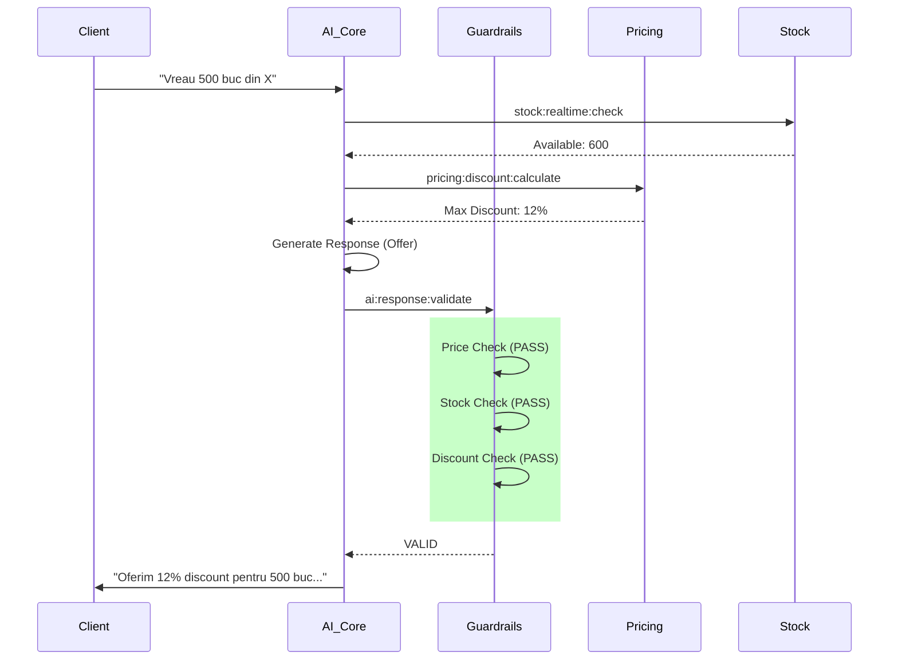
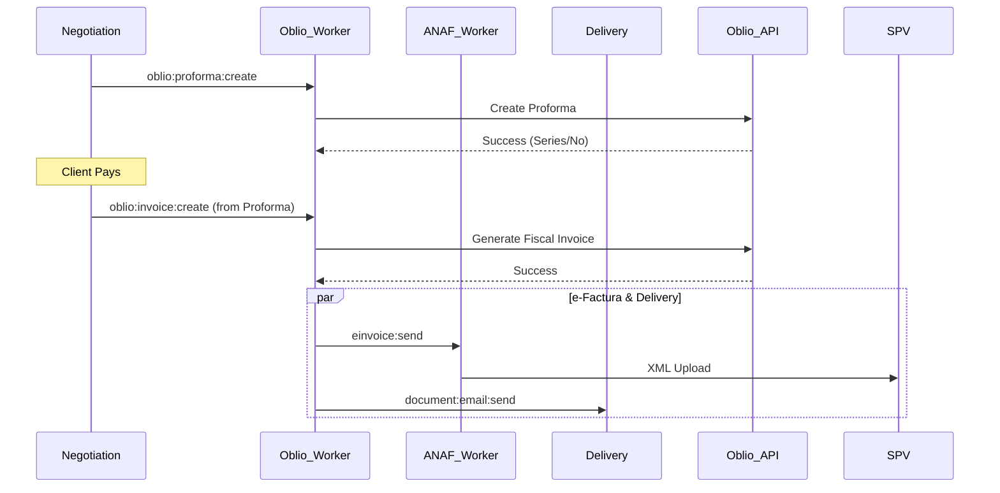

# Etapa 3 - Workers Overview

## AI Sales Agent Neuro-Symbolic: Documentație Completă Workers

**Versiune:** 2.0  
**Data:** 01 Februarie 2026  
**Total Workers:** 78 (53 core + 25 adiționali)  
**Categorii:** 14 (A-N)  
**Paradigmă:** Neuro-Symbolic AI (Zero Hallucination)  
**Sprint Plan:** Vezi [etapa3-sprint-plan.md](etapa3-sprint-plan.md) pentru maparea completă PR-uri

---

## Cuprins

1. [Viziune Generală](#1-viziune-generală)
2. [Arhitectură Workers](#2-arhitectură-workers)
3. [Inventar Complet Workers](#3-inventar-complet-workers)
4. [Matrice Categorii](#4-matrice-categorii)
5. [Configurație BullMQ](#5-configurație-bullmq)
6. [Fluxuri Critice](#6-fluxuri-critice)
7. [Monitorizare și Alertare](#7-monitorizare-și-alertare)
8. [Rate Limits și Costuri](#8-rate-limits-și-costuri)
9. [Dependențe între Etape](#9-dependențe-între-etape)

---

## 1. Viziune Generală

### 1.1 Paradigma Neuro-Simbolică

Etapa 3 implementează un **agent comercial autonom** care navighează ciclul complet de vânzare: de la primul contact până la emiterea facturii și înregistrarea în SPV.

```text
┌──────────────────────────────────────────────────────────────────────────────────┐
│                    PARADIGMA NEURO-SIMBOLICĂ - ZERO HALLUCINATION                │
│                                                                                  │
│   ┌─────────────────┐        ┌─────────────────┐        ┌─────────────────┐      │
│   │   NEURAL LAYER  │        │  SYMBOLIC LAYER │        │  OUTPUT LAYER   │      │
│   │   (xAI Grok)    │───────▶│   (Guardrails)  │───────▶│   (Validated)   │      │
│   │                 │        │                 │        │                 │      │
│   │  • Înțelege     │        │  • Verifică     │        │  • Preț corect  │      │
│   │    context      │        │    preț vs DB   │        │  • Stoc real    │      │
│   │  • Generează    │        │  • Validează    │        │  • Discount     │      │
│   │    răspuns      │        │    stoc live    │        │    aprobat      │      │
│   │  • Propune      │        │  • Aplică       │        │  • Document     │      │
│   │    acțiuni      │        │    reguli       │        │    fiscal valid │      │
│   └─────────────────┘        └─────────────────┘        └─────────────────┘      │
│                                                                                  │
│   Dacă Guardrail REJECTEAZĂ → LLM regenerează răspunsul cu feedback corectiv     │
└──────────────────────────────────────────────────────────────────────────────────┘
```

### 1.2 Componenta Neurală (LLM)

| Aspect | Specificație |
| ------ | ------------ |
| Provider | xAI Grok-4 |
| Funcție | Flexibilitate lingvistică, înțelegerea contextului |
| Integrare | MCP (Model Context Protocol) |
| Function Calling | Nativ suportat |
| Rate Limit | 60 RPM |
| Cost | ~$0.02/1K tokens |

### 1.3 Componenta Simbolică (Guardrails)

| Guardrail | Scop | Acțiune pe FAIL |
| --------- | ---- | --------------- |
| `guardrail:price:check` | Verifică preț vs DB | Corectează cu preț real |
| `guardrail:stock:check` | Validează stoc live | Anunță indisponibilitate |
| `guardrail:discount:check` | Verifică marja minimă | Limitează la max permis |
| `guardrail:sku:validate` | Verifică existența SKU | Sugerează alternative |
| `guardrail:fiscal:validate` | Validează date fiscale | Solicită corecție |

### 1.4 Riscuri Eliminate

| Risc | Exemplu | Soluție Neuro-Simbolică |
| ---- | ------- | ----------------------- |
| **Preț Halucinat** | AI oferă 50% discount neautorizat | `calculate_discount()` verifică marja minimă |
| **Stoc Fantomă** | AI confirmă produs epuizat | `check_realtime_stock()` interogă ERP live |
| **SKU Inventat** | AI inventează cod produs | `validate_sku()` verifică existența în DB |
| **Factură Eronată** | Date fiscale incorecte | Validare CUI/IBAN înainte de Oblio API |
| **Termen e-Factura** | Depășire 5 zile SPV | Cron job safety net la 4 zile |

---

## 2. Arhitectură Workers

### 2.1 Stack Tehnologic

| Componentă | Tehnologie | Versiune |
| ---------- | ---------- | -------- |
| Queue System | BullMQ | v5.66.5 |
| Cache/Broker | Redis | 8.4.0 |
| Runtime Node.js | Node.js | v24.12.0 LTS |
| Runtime Python | Python | 3.14.1 (Free-Threading) |
| Database | PostgreSQL | 18.1 |
| Vector Search | pgvector | 0.8.0 |
| Protocol | MCP | Latest |
| LLM Provider | xAI Grok | Grok-4 |

### 2.2 Layered Architecture

```text
┌──────────────────────────────────────────────────────────────────────────────────┐
│                              LAYER 1: INGESTION                                  │
│  ┌─────────────────────────────────────────────────────────────────────────────┐ │
│  │  webhook:ingest → message:normalize → handover:detect → channel:route       │ │
│  └─────────────────────────────────────────────────────────────────────────────┘ │
└──────────────────────────────────────────────────────────────────────────────────┘
                                         │
                                         ▼
┌──────────────────────────────────────────────────────────────────────────────────┐
│                             LAYER 2: AI PROCESSING                               │
│  ┌─────────────────────────────────────────────────────────────────────────────┐ │
│  │  ai:context:build → ai:agent:orchestrate → ai:response:generate             │ │
│  │                            │                                                │ │
│  │                    ┌───────┴───────┐                                        │ │
│  │                    ▼               ▼                                        │ │
│  │           MCP Tool Calls    Guardrail Checks                                │ │
│  └─────────────────────────────────────────────────────────────────────────────┘ │
└──────────────────────────────────────────────────────────────────────────────────┘
                                         │
                                         ▼
┌──────────────────────────────────────────────────────────────────────────────────┐
│                            LAYER 3: BUSINESS LOGIC                               │
│  ┌──────────────┐  ┌──────────────┐  ┌──────────────┐  ┌──────────────┐          │
│  │   Product    │  │  Negotiation │  │   Pricing    │  │    Stock     │          │
│  │   Knowledge  │  │    FSM       │  │  & Discount  │  │  Management  │          │
│  └──────────────┘  └──────────────┘  └──────────────┘  └──────────────┘          │
└──────────────────────────────────────────────────────────────────────────────────┘
                                         │
                                         ▼
┌──────────────────────────────────────────────────────────────────────────────────┐
│                            LAYER 4: FISCAL & OUTPUT                              │
│  ┌──────────────────────────────────────────────────────────────────────────────┐│
│  │  oblio:proforma:create → oblio:invoice:create → einvoice:send → delivery     ││
│  └──────────────────────────────────────────────────────────────────────────────┘│
└──────────────────────────────────────────────────────────────────────────────────┘
```

### 2.3 Worker Categories Overview

```text
┌───────────────────────────────────────────────────────────────────────────────┐
│                        ETAPA 3 - 78 WORKERS TOTAL                             │
│                                                                               │
│  ┌─────────────────────────────────────────────────────────────────────────┐  │
│  │  CATEGORIA A: Product Knowledge (6 workers)                             │  │
│  │  #1-6: Ingest, Embed, Chunk, Index, Categories, Sync                    │  │
│  └─────────────────────────────────────────────────────────────────────────┘  │
│                                                                               │
│  ┌─────────────────────────────────────────────────────────────────────────┐  │
│  │  CATEGORIA B: Hybrid Search RAG (6 workers)                             │  │
│  │  #7-12: Query Rewrite, Vector Search, BM25, RRF Fusion, Filter, Cache   │  │
│  └─────────────────────────────────────────────────────────────────────────┘  │
│                                                                               │
│  ┌─────────────────────────────────────────────────────────────────────────┐  │
│  │  CATEGORIA C: AI Agent Core (6 workers)                                 │  │
│  │  #13-18: Context Build, Orchestrate, Generate, Validate, Store, Retry   │  │
│  └─────────────────────────────────────────────────────────────────────────┘  │
│                                                                               │
│  ┌─────────────────────────────────────────────────────────────────────────┐  │
│  │  CATEGORIA D: Negotiation FSM (8 workers)                               │  │
│  │  #19-26: Transition, History, Items, Reminder, Expire, Close, Reopen    │  │
│  └─────────────────────────────────────────────────────────────────────────┘  │
│                                                                               │
│  ┌─────────────────────────────────────────────────────────────────────────┐  │
│  │  CATEGORIA E: Pricing & Discount (6 workers)                            │  │
│  │  #27-32: Calculate, Apply, Approve, Margin Check, Volume, Competitor    │  │
│  └─────────────────────────────────────────────────────────────────────────┘  │
│                                                                               │
│  ┌─────────────────────────────────────────────────────────────────────────┐  │
│  │  CATEGORIA F: Stock & Inventory (6 workers)                             │  │
│  │  #33-38: Realtime Check, Reserve, Release, Sync, Low Stock, Alert       │  │
│  └─────────────────────────────────────────────────────────────────────────┘  │
│                                                                               │
│  ┌─────────────────────────────────────────────────────────────────────────┐  │
│  │  CATEGORIA G: Oblio Integration (7 workers)                             │  │
│  │  #39-45: Proforma Create, Invoice Create, Cancel, Client, Sync, Webhook │  │
│  └─────────────────────────────────────────────────────────────────────────┘  │
│                                                                               │
│  ┌─────────────────────────────────────────────────────────────────────────┐  │
│  │  CATEGORIA H: e-Factura SPV (5 workers)                                 │  │
│  │  #46-50: Send, Status Check, Deadline Monitor, Archive, Retry           │  │
│  └─────────────────────────────────────────────────────────────────────────┘  │
│                                                                               │
│  ┌─────────────────────────────────────────────────────────────────────────┐  │
│  │  CATEGORIA I: Document Generation (5 workers)                           │  │
│  │  #51-55: PDF Generate, Email Send, WhatsApp Send, Template, Archive     │  │
│  └─────────────────────────────────────────────────────────────────────────┘  │
│                                                                               │
│  ┌─────────────────────────────────────────────────────────────────────────┐  │
│  │  CATEGORIA J: Handover & Channel (5 workers)                            │  │
│  │  #56-60: Detect, Context Load, Channel Route, WhatsApp, Email           │  │
│  └─────────────────────────────────────────────────────────────────────────┘  │
│                                                                               │
│  ┌─────────────────────────────────────────────────────────────────────────┐  │
│  │  CATEGORIA K: Sentiment & Intent (5 workers)                            │  │
│  │  #61-65: Analyze, Classify, Objection Detect, Trend, Feedback           │  │
│  └─────────────────────────────────────────────────────────────────────────┘  │
│                                                                               │
│  ┌─────────────────────────────────────────────────────────────────────────┐  │
│  │  CATEGORIA L: MCP Server (5 workers)                                    │  │
│  │  #66-70: Resource Load, Tool Register, Session Manage, Health, Metrics  │  │
│  └─────────────────────────────────────────────────────────────────────────┘  │
│                                                                               │
│  ┌─────────────────────────────────────────────────────────────────────────┐  │
│  │  CATEGORIA M: Guardrails (5 workers)                                    │  │
│  │  #71-75: Price Check, Stock Check, Discount Check, SKU Validate, Fiscal │  │
│  └─────────────────────────────────────────────────────────────────────────┘  │
│                                                                               │
│  ┌─────────────────────────────────────────────────────────────────────────┐  │
│  │  CATEGORIA N: Human Intervention (3 workers)                            │  │
│  │  #76-78: Escalate, Takeover, Approve                                    │  │
│  └─────────────────────────────────────────────────────────────────────────┘  │
│                                                                               │
│  PIPELINE CONTROL: 3 workers (Health, Metrics, Cleanup)                       │
└───────────────────────────────────────────────────────────────────────────────┘
```

---

## 3. Inventar Complet Workers

> **Notă:** Toate queue-urile Etapa 3 sunt prefixate la runtime cu `etapa3:`. În tabelele de mai jos, prefixul este implicit pentru lizibilitate.

### 3.1 Categoria A: Product Knowledge Workers (#1-6)

| # | Queue Name | Scop | Rate Limit | Concurrency | Critical |
| - | ---------- | ---- | ---------- | ----------- | -------- |
| 1 | `product:ingest` | Ingestie produse din ERP/CSV | Fără | 5 | - |
| 2 | `product:embed` | Generare embeddings produse | 60/min | 10 | - |
| 3 | `product:chunk` | Chunking descrieri pentru RAG | Fără | 20 | - |
| 4 | `product:index:rebuild` | Rebuild index căutare | Manual | 1 | - |
| 5 | `product:category:sync` | Sincronizare categorii | Fără | 5 | - |
| 6 | `product:variant:process` | Procesare variante produs | Fără | 10 | - |

**Responsabilități:**

- Ingestie date produse din surse externe (ERP, CSV, API)
- Generare embeddings cu OpenAI text-embedding-3-small
- Chunking descrieri lungi pentru retrieval optim
- Menținere index căutare actualizat
- Sincronizare ierarhie categorii

### 3.2 Categoria B: Hybrid Search Workers (#7-12)

| ## | Queue Name | Scop | Rate Limit | Concurrency | Critical |
| -- | ---------- | ---- | ---------- | ----------- | -------- |
| 7 | `search:query:rewrite` | Reformulare query pentru relevanță | 60/min | 20 | - |
| 8 | `search:vector:execute` | Căutare vectorială pgvector | Fără | 50 | - |
| 9 | `search:bm25:execute` | Căutare lexicală BM25 | Fără | 50 | - |
| 10 | `search:rrf:fuse` | Fuziune RRF (vector + BM25) | Fără | 50 | - |
| 11 | `search:filter:apply` | Aplicare filtre (categorie, preț, stoc) | Fără | 50 | - |
| 12 | `search:cache:manage` | Cache rezultate frecvente | Fără | 10 | - |

**Responsabilități:**

- Query rewriting cu LLM pentru îmbunătățire relevanță
- Căutare vectorială cu cosine similarity
- Căutare lexicală BM25 cu PostgreSQL tsvector
- Fuziune rezultate cu Reciprocal Rank Fusion (60% vector + 40% BM25)
- Caching rezultate frecvente în Redis

### 3.3 Categoria C: AI Agent Core Workers (#13-18)

| ## | Queue Name | Scop | Rate Limit | Concurrency | Critical |
| -- | ---------- | ---- | ---------- | ----------- | -------- |
| 13 | `ai:context:build` | Construire context conversație | Fără | 50 | - |
| 14 | `ai:agent:orchestrate` | Orchestrare agent + tool calls | 60/min | 20 | **DA** |
| 15 | `ai:response:generate` | Generare răspuns final | 60/min | 20 | **DA** |
| 16 | `ai:response:validate` | Validare răspuns cu guardrails | Fără | 50 | **DA** |
| 17 | `ai:conversation:store` | Salvare conversație în DB | Fără | 100 | - |
| 18 | `ai:retry:regenerate` | Regenerare pe guardrail fail | 60/min | 10 | - |

**Responsabilități:**

- Construire context din istoric, produs, client
- Orchestrare tool calls în buclă
- Generare răspuns personalizat
- Validare cu toate guardrails
- Salvare conversație pentru audit
- Retry cu feedback pe fail (max 3 încercări)

### 3.4 Categoria D: Negotiation FSM Workers (#19-26)

| ## | Queue Name | Scop | Rate Limit | Concurrency | Critical |
| -- | ---------- | ---- | ---------- | ----------- | -------- |
| 19 | `negotiation:state:transition` | Tranziție stare FSM | Fără | 50 | **DA** |
| 20 | `negotiation:history:log` | Log tranziții pentru audit | Fără | 100 | - |
| 21 | `negotiation:items:update` | Update items în coș | Fără | 50 | - |
| 22 | `negotiation:reminder:send` | Reminder negocieri stagnante | Cron */6h | 10 | - |
| 23 | `negotiation:expire:check` | Expirare negocieri inactive | Cron */1h | 5 | - |
| 24 | `negotiation:close:execute` | Închidere negociere cu succes | Fără | 20 | - |
| 25 | `negotiation:reopen:request` | Redeschidere negociere închisă | Fără | 5 | - |
| 26 | `negotiation:abandon:process` | Procesare abandon | Fără | 10 | - |

**Responsabilități:**

- Validare și execuție tranziții FSM
- Logging complet pentru audit trail
- Gestionare items în coș negociere
- Remindere pentru negocieri stagnante (>6h)
- Auto-expirare negocieri inactive (>7 zile)
- Workflow închidere cu succes → Proforma

### 3.5 Categoria E: Pricing & Discount Workers (#27-32)

| ## | Queue Name | Scop | Rate Limit | Concurrency | Critical |
| -- | ---------- | ---- | ---------- | ----------- | -------- |
| 27 | `pricing:discount:calculate` | Calcul discount maxim permis | Fără | 50 | **DA** |
| 28 | `pricing:discount:apply` | Aplicare discount pe items | Fără | 50 | - |
| 29 | `pricing:discount:approve` | Aprobare discount > limită | Fără | 10 | **DA** |
| 30 | `pricing:margin:check` | Verificare marja minimă | Fără | 50 | **DA** |
| 31 | `pricing:volume:calculate` | Calcul discount volum | Fără | 20 | - |
| 32 | `pricing:competitor:check` | Verificare prețuri competiție | Cron */24h | 5 | - |

**Responsabilități:**

- Calculare discount maxim bazat pe reguli
- Aplicare discount validat pe items
- Workflow aprobare pentru discounturi mari (>15%)
- Verificare marja minimă per produs (min 8%)
- Discount progresiv pe volum
- Monitorizare prețuri competiție (opțional)

### 3.6 Categoria F: Stock & Inventory Workers (#33-38)

| ## | Queue Name | Scop | Rate Limit | Concurrency | Critical |
| -- | ---------- | ---- | ---------- | ----------- | -------- |
| 33 | `stock:realtime:check` | Verificare stoc live | Fără | 100 | **DA** |
| 34 | `stock:reserve:create` | Creare rezervare stoc | Fără | 50 | - |
| 35 | `stock:reserve:release` | Eliberare rezervare expirată | Cron */5min | 10 | - |
| 36 | `stock:sync:erp` | Sincronizare stoc cu ERP | Cron */15min | 5 | - |
| 37 | `stock:low:alert` | Alert stoc scăzut | Cron */1h | 5 | - |
| 38 | `stock:replenish:request` | Cerere reaprovizionare | Fără | 5 | - |

**Responsabilități:**

- Verificare stoc în timp real
- Rezervare stoc per negociere (TTL-based)
- Eliberare automată rezervări expirate
- Sincronizare periodică cu ERP
- Alertare pe stoc scăzut
- Workflow cerere reaprovizionare

### 3.7 Categoria G: Oblio Integration Workers (#39-45)

| ## | Queue Name | Scop | Rate Limit | Concurrency | Critical |
| -- | ---------- | ---- | ---------- | ----------- | -------- |
| 39 | `oblio:proforma:create` | Creare proforma în Oblio | 60/min | 20 | **DA** |
| 40 | `oblio:proforma:update` | Update proforma existentă | 60/min | 10 | - |
| 41 | `oblio:invoice:create` | Creare factură fiscală | 60/min | 20 | **DA** |
| 42 | `oblio:invoice:cancel` | Anulare factură (storno) | 10/min | 5 | - |
| 43 | `oblio:client:validate` | Validare date client cu ANAF | 1 req/sec (max 100 CUI/request) | 20 | - |
| 44 | `oblio:stock:sync` | Sincronizare stoc cu Oblio | Cron */30min | 5 | - |
| 45 | `oblio:webhook:process` | Procesare webhooks Oblio | Fără | 20 | - |

**Responsabilități:**

- Emitere proforme și facturi via Oblio API
- Validare date client înainte de emitere
- Procesare anulări (storno) conform legii
- Sincronizare stoc bidirecțional
- Procesare evenimente webhook Oblio

### 3.8 Categoria H: e-Factura SPV Workers (#46-50)

| ## | Queue Name | Scop | Rate Limit | Concurrency | Critical |
| -- | ---------- | ---- | ---------- | ----------- | -------- |
| 46 | `einvoice:send` | Trimitere e-Factura în SPV | 30/min | 10 | **DA** |
| 47 | `einvoice:status:check` | Verificare status SPV | Cron */30min | 5 | - |
| 48 | `einvoice:deadline:monitor` | Monitorizare deadline 5 zile | Cron 09:00 | 1 | **DA** |
| 49 | `einvoice:archive:download` | Download arhivă SPV | Cron */24h | 1 | - |
| 50 | `einvoice:retry:failed` | Retry facturi eșuate | Cron */1h | 5 | - |

**Responsabilități:**

- Trimitere e-Factura în SPV ANAF via Oblio
- Verificare periodică status procesare
- **SAFETY NET:** Monitorizare deadline 5 zile
- Download și arhivare documente SPV
- Retry automat pentru eșecuri temporare

### 3.9 Categoria I: Document Generation Workers (#51-55)

| ## | Queue Name | Scop | Rate Limit | Concurrency | Critical |
| -- | ---------- | ---- | ---------- | ----------- | -------- |
| 51 | `document:pdf:generate` | Generare PDF personalizat | Fără | 10 | - |
| 52 | `document:email:send` | Trimitere document pe email | 100/sec | 50 | - |
| 53 | `document:whatsapp:send` | Trimitere document pe WhatsApp | Quota | 1/phone | - |
| 54 | `document:template:compile` | Compilare template-uri | Fără | 5 | - |
| 55 | `document:archive:store` | Arhivare documente | Fără | 20 | - |

**Responsabilități:**

- Generare PDF personalizate (WeasyPrint + Jinja2)
- Trimitere multi-canal (email, WhatsApp)
- Gestionare template-uri document
- Arhivare pentru conformitate

### 3.10 Categoria J: Handover & Channel Workers (#56-60)

| ## | Queue Name | Scop | Rate Limit | Concurrency | Critical |
| -- | ---------- | ---- | ---------- | ----------- | -------- |
| 56 | `handover:detect` | Detectare răspuns lead | Fără | 100 | - |
| 57 | `handover:context:load` | Încărcare context conversație | Fără | 50 | - |
| 58 | `channel:route:decide` | Decizie canal optim | Fără | 50 | - |
| 59 | `channel:whatsapp:send` | Trimitere mesaj WhatsApp | Quota | 1/phone | - |
| 60 | `channel:email:send` | Trimitere mesaj email | 100/sec | 50 | - |

**Responsabilități:**

- Detectare răspuns de la lead → activare AI
- Încărcare istoric conversație din Etapa 2
- Decizie canal optim bazat pe preferințe
- Trimitere mesaje pe canalul selectat

### 3.11 Categoria K: Sentiment & Intent Workers (#61-65)

| ## | Queue Name | Scop | Rate Limit | Concurrency | Critical |
| -- | ---------- | ---- | ---------- | ----------- | -------- |
| 61 | `sentiment:analyze` | Analiză sentiment mesaj | 60/min | 20 | - |
| 62 | `intent:classify` | Clasificare intenție | 60/min | 20 | - |
| 63 | `objection:detect` | Detectare obiecții | 60/min | 20 | - |
| 64 | `sentiment:trend:analyze` | Trend sentiment pe timp | Cron */6h | 5 | - |
| 65 | `feedback:collect` | Colectare feedback client | Fără | 10 | - |

**Responsabilități:**

- Analiză sentiment (pozitiv/neutru/negativ)
- Clasificare intenție (întrebare, comandă, obiecție, închidere)
- Detectare și clasificare obiecții (preț, livrare, calitate)
- Analiză trend sentiment
- Colectare feedback pentru îmbunătățire

### 3.12 Categoria L: MCP Server Workers (#66-70)

| ## | Queue Name | Scop | Rate Limit | Concurrency | Critical |
| -- | ---------- | ---- | ---------- | ----------- | -------- |
| 66 | `mcp:resource:load` | Încărcare resurse MCP | Fără | 100 | - |
| 67 | `mcp:tool:register` | Înregistrare tools MCP | Fără | 5 | - |
| 68 | `mcp:session:manage` | Gestionare sesiuni MCP | Fără | 50 | - |
| 69 | `mcp:health:check` | Verificare sănătate server | Cron */1min | 1 | - |
| 70 | `mcp:metrics:collect` | Colectare metrici MCP | Cron */5min | 1 | - |

**Responsabilități:**

- Încărcare resurse (product://, client://, conversation://)
- Înregistrare și expunere tools către LLM
- Gestionare sesiuni și context
- Monitorizare sănătate server MCP
- Colectare metrici utilizare

### 3.13 Categoria M: Guardrails Workers (#71-75)

| ## | Queue Name | Scop | Rate Limit | Concurrency | Critical |
| -- | ---------- | ---- | ---------- | ----------- | -------- |
| 71 | `guardrail:price:check` | Verificare preț vs DB | Fără | 100 | **DA** |
| 72 | `guardrail:stock:check` | Verificare stoc disponibil | Fără | 100 | **DA** |
| 73 | `guardrail:discount:check` | Verificare discount valid | Fără | 100 | **DA** |
| 74 | `guardrail:sku:validate` | Validare SKU existent | Fără | 100 | **DA** |
| 75 | `guardrail:fiscal:validate` | Validare date fiscale | Fără | 50 | **DA** |

**Responsabilități:**

- Validare preț menționat vs preț real din DB
- Verificare stoc în timp real înainte de confirmare
- Validare discount în limita permisă
- Verificare existență SKU în catalog
- Validare date fiscale (CUI, IBAN) înainte de emitere

### 3.14 Categoria N: Human Intervention Workers (#76-78)

| ## | Queue Name | Scop | Rate Limit | Concurrency | Critical |
| -- | ---------- | ---- | ---------- | ----------- | -------- |
| 76 | `human:escalate` | Escaladare către operator | Fără | 50 | - |
| 77 | `human:takeover` | Preluare manuală conversație | Fără | 20 | - |
| 78 | `human:approve` | Aprobare acțiuni critice | Fără | 20 | - |

**Responsabilități:**

- Escaladare conversații complexe/sensibile
- Preluare manuală când AI nu poate rezolva
- Aprobare discounturi mari, stornări, excepții

### 3.15 Pipeline Control Workers

| ## | Queue Name | Scop | Rate Limit | Concurrency | Critical |
| -- | ---------- | ---- | ---------- | ----------- | -------- |
| - | `pipeline:ai-sales:health` | Verificare sănătate pipeline | Cron */1min | 1 | - |
| - | `pipeline:ai-sales:metrics` | Colectare metrici pipeline | Cron */5min | 1 | - |
| - | `pipeline:ai-sales:cleanup` | Curățare date vechi | Cron 02:00 | 1 | - |

---

## 4. Matrice Categorii

### 4.1 Distribuție Workers per Categorie

| Categorie | Nume | Workers | Critical | Cron Jobs |
| --------- | ---- | ------- | -------- | --------- |
| A | Product Knowledge | 6 | 0 | 0 |
| B | Hybrid Search | 6 | 0 | 0 |
| C | AI Agent Core | 6 | 3 | 0 |
| D | Negotiation FSM | 8 | 1 | 2 |
| E | Pricing & Discount | 6 | 3 | 1 |
| F | Stock & Inventory | 6 | 1 | 3 |
| G | Oblio Integration | 7 | 2 | 1 |
| H | e-Factura SPV | 5 | 2 | 3 |
| I | Document Generation | 5 | 0 | 0 |
| J | Handover & Channel | 5 | 0 | 0 |
| K | Sentiment & Intent | 5 | 0 | 1 |
| L | MCP Server | 5 | 0 | 2 |
| M | Guardrails | 5 | 5 | 0 |
| N | Human Intervention | 3 | 0 | 0 |
| - | Pipeline Control | 3 | 0 | 3 |
| **TOTAL** | | **81** | **17** | **16** |

### 4.2 Workers Critice (17 total)

Acești workeri au impact direct asupra corectitudinii datelor și conformității fiscale:

```text
CATEGORIA C - AI Agent Core:
├── ai:agent:orchestrate      - Orchestrare corectă tool calls
├── ai:response:generate      - Generare răspuns valid
└── ai:response:validate      - Validare cu guardrails

CATEGORIA D - Negotiation FSM:
└── negotiation:state:transition - Tranziții FSM valide

CATEGORIA E - Pricing & Discount:
├── pricing:discount:calculate   - Calcul discount corect
├── pricing:discount:approve     - Aprobare discounturi mari
└── pricing:margin:check         - Verificare marja minimă

CATEGORIA F - Stock & Inventory:
└── stock:realtime:check         - Verificare stoc live

CATEGORIA G - Oblio Integration:
├── oblio:proforma:create        - Emitere proformă corectă
└── oblio:invoice:create         - Emitere factură corectă

CATEGORIA H - e-Factura SPV:
├── einvoice:send                - Trimitere e-Factura
└── einvoice:deadline:monitor    - Safety net 5 zile

CATEGORIA M - Guardrails (TOATE):
├── guardrail:price:check        - Preț vs DB
├── guardrail:stock:check        - Stoc disponibil
├── guardrail:discount:check     - Discount valid
├── guardrail:sku:validate       - SKU existent
└── guardrail:fiscal:validate    - Date fiscale corecte
```

### 4.3 Matrice Dependențe între Categorii

```text
┌──────────────────────────────────────────────────────────────────────────────┐
│                    MATRICE DEPENDENȚE CATEGORII                              │
│                                                                              │
│        A    B    C    D    E    F    G    H    I    J    K    L    M    N    │
│     ┌─────────────────────────────────────────────────────────────────────┐  │
│  A  │  -   ←                                                              │  │
│  B  │  →   -   ←                                                          │  │
│  C  │       →   -   ↔   ↔   ↔                  ←        ↔   ←             │  │
│  D  │            ↔   -   ↔   ↔   ←                                  ←     │  │
│  E  │            ↔   ↔   -        ←                      ←          ←     │  │
│  F  │            ↔   ↔        -   ←                      ←                │  │
│  G  │            ↔   →   →   →   -   →   →                                │  │
│  H  │                            ←   -                                    │  │
│  I  │                            ←        -   ←                           │  │
│  J  │            →                             →   -                      │  │
│  K  │            ↔                                  -                     │  │
│  L  │            ↔                                       -                │  │
│  M  │            →                                            -           │  │
│  N  │            →   →   →                                         -      │  │
│     └─────────────────────────────────────────────────────────────────────┘  │
│                                                                              │
│  Legendă: → depinde de | ← este folosit de | ↔ bidirecțional                 │
└──────────────────────────────────────────────────────────────────────────────┘
```

---

## 5. Configurație BullMQ

### 5.1 Configurație Globală

```typescript
// packages/workers-etapa3/src/config/bullmq.config.ts

import { QueueOptions, WorkerOptions } from 'bullmq';

export const REDIS_CONFIG = {
  host: process.env.REDIS_HOST || 'localhost',
  port: parseInt(process.env.REDIS_PORT || '64039'),
  password: process.env.REDIS_PASSWORD,
  maxRetriesPerRequest: null,
  enableReadyCheck: false,
};

export const DEFAULT_QUEUE_OPTIONS: QueueOptions = {
  connection: REDIS_CONFIG,
  defaultJobOptions: {
    attempts: 3,
    backoff: {
      type: 'exponential',
      delay: 1000,
    },
    removeOnComplete: {
      age: 24 * 3600, // 24 hours
      count: 1000,
    },
    removeOnFail: {
      age: 7 * 24 * 3600, // 7 days
    },
  },
};

export const DEFAULT_WORKER_OPTIONS: WorkerOptions = {
  connection: REDIS_CONFIG,
  concurrency: 10,
  limiter: {
    max: 100,
    duration: 1000,
  },
};

// Configurație per categorie
export const CATEGORY_CONFIGS = {
  A_PRODUCT_KNOWLEDGE: {
    concurrency: 10,
    limiter: { max: 60, duration: 60000 }, // 60/min pentru embeddings
  },
  B_HYBRID_SEARCH: {
    concurrency: 50,
    limiter: { max: 1000, duration: 1000 }, // High throughput
  },
  C_AI_AGENT: {
    concurrency: 20,
    limiter: { max: 60, duration: 60000 }, // LLM rate limit
  },
  D_NEGOTIATION: {
    concurrency: 50,
    limiter: { max: 500, duration: 1000 },
  },
  E_PRICING: {
    concurrency: 50,
    limiter: { max: 500, duration: 1000 },
  },
  F_STOCK: {
    concurrency: 100,
    limiter: { max: 1000, duration: 1000 },
  },
  G_OBLIO: {
    concurrency: 20,
    limiter: { max: 60, duration: 60000 }, // API rate limit
  },
  H_EINVOICE: {
    concurrency: 10,
    limiter: { max: 30, duration: 60000 },
  },
  I_DOCUMENT: {
    concurrency: 10,
    limiter: { max: 100, duration: 1000 },
  },
  J_HANDOVER: {
    concurrency: 100,
    limiter: { max: 500, duration: 1000 },
  },
  K_SENTIMENT: {
    concurrency: 20,
    limiter: { max: 60, duration: 60000 },
  },
  L_MCP: {
    concurrency: 100,
    limiter: { max: 1000, duration: 1000 },
  },
  M_GUARDRAILS: {
    concurrency: 100,
    limiter: { max: 1000, duration: 1000 }, // Nu e limitat
  },
  N_HUMAN: {
    concurrency: 50,
    limiter: { max: 500, duration: 1000 },
  },
};
```

### 5.2 Queue Definitions

```typescript
// packages/workers-etapa3/src/queues/index.ts

import { Queue } from 'bullmq';
import { DEFAULT_QUEUE_OPTIONS, CATEGORY_CONFIGS } from '../config/bullmq.config';

// Categoria A: Product Knowledge
export const productIngestQueue = new Queue('product:ingest', {
  ...DEFAULT_QUEUE_OPTIONS,
  defaultJobOptions: {
    ...DEFAULT_QUEUE_OPTIONS.defaultJobOptions,
    priority: 2,
  },
});

export const productEmbedQueue = new Queue('product:embed', {
  ...DEFAULT_QUEUE_OPTIONS,
  defaultJobOptions: {
    ...DEFAULT_QUEUE_OPTIONS.defaultJobOptions,
    attempts: 5, // Mai multe retry pentru embeddings
  },
});

// Categoria C: AI Agent Core
export const aiContextBuildQueue = new Queue('ai:context:build', DEFAULT_QUEUE_OPTIONS);

export const aiAgentOrchestrateQueue = new Queue('ai:agent:orchestrate', {
  ...DEFAULT_QUEUE_OPTIONS,
  defaultJobOptions: {
    ...DEFAULT_QUEUE_OPTIONS.defaultJobOptions,
    priority: 1, // High priority
    timeout: 120000, // 2 minute timeout pentru LLM
  },
});

export const aiResponseGenerateQueue = new Queue('ai:response:generate', {
  ...DEFAULT_QUEUE_OPTIONS,
  defaultJobOptions: {
    ...DEFAULT_QUEUE_OPTIONS.defaultJobOptions,
    priority: 1,
    timeout: 60000,
  },
});

// Categoria G: Oblio Integration
export const oblioProformaCreateQueue = new Queue('oblio:proforma:create', {
  ...DEFAULT_QUEUE_OPTIONS,
  defaultJobOptions: {
    ...DEFAULT_QUEUE_OPTIONS.defaultJobOptions,
    attempts: 5,
    backoff: {
      type: 'exponential',
      delay: 5000,
    },
  },
});

export const oblioInvoiceCreateQueue = new Queue('oblio:invoice:create', {
  ...DEFAULT_QUEUE_OPTIONS,
  defaultJobOptions: {
    ...DEFAULT_QUEUE_OPTIONS.defaultJobOptions,
    attempts: 5,
    backoff: {
      type: 'exponential',
      delay: 5000,
    },
  },
});

// Categoria H: e-Factura
export const einvoiceSendQueue = new Queue('einvoice:send', {
  ...DEFAULT_QUEUE_OPTIONS,
  defaultJobOptions: {
    ...DEFAULT_QUEUE_OPTIONS.defaultJobOptions,
    attempts: 10, // Critical - mai multe retry
    backoff: {
      type: 'exponential',
      delay: 10000,
    },
  },
});

// Categoria M: Guardrails
export const guardrailPriceCheckQueue = new Queue('guardrail:price:check', {
  ...DEFAULT_QUEUE_OPTIONS,
  defaultJobOptions: {
    ...DEFAULT_QUEUE_OPTIONS.defaultJobOptions,
    timeout: 5000, // Fast timeout pentru guardrails
  },
});

// Export toate queue-urile
export const ALL_QUEUES = {
  // A
  'product:ingest': productIngestQueue,
  'product:embed': productEmbedQueue,
  // ... restul queue-urilor
};
```

### 5.3 Scheduled Jobs (Cron)

```typescript
// packages/workers-etapa3/src/scheduler/cron-jobs.ts

import { Queue } from 'bullmq';
import { DEFAULT_QUEUE_OPTIONS } from '../config/bullmq.config';

const schedulerQueue = new Queue('scheduler', DEFAULT_QUEUE_OPTIONS);

export const CRON_JOBS = [
  // Stock
  {
    name: 'stock:reserve:release',
    cron: '*/5 * * * *', // La fiecare 5 minute
    data: { type: 'cleanup_expired_reservations' },
  },
  {
    name: 'stock:sync:erp',
    cron: '*/15 * * * *', // La fiecare 15 minute
    data: { type: 'sync_with_erp' },
  },
  {
    name: 'stock:low:alert',
    cron: '0 * * * *', // La fiecare oră
    data: { type: 'check_low_stock' },
  },
  
  // e-Factura - CRITICAL
  {
    name: 'einvoice:deadline:monitor',
    cron: '0 9 * * *', // Zilnic la 09:00
    data: { type: 'check_deadline' },
    priority: 1, // Highest priority
  },
  {
    name: 'einvoice:status:check',
    cron: '*/30 * * * *', // La fiecare 30 minute
    data: { type: 'check_spv_status' },
  },
  {
    name: 'einvoice:retry:failed',
    cron: '0 * * * *', // La fiecare oră
    data: { type: 'retry_failed' },
  },
  
  // Negotiation
  {
    name: 'negotiation:reminder:send',
    cron: '0 */6 * * *', // La fiecare 6 ore
    data: { type: 'send_reminders' },
  },
  {
    name: 'negotiation:expire:check',
    cron: '0 * * * *', // La fiecare oră
    data: { type: 'check_expired' },
  },
  
  // Pipeline Control
  {
    name: 'pipeline:ai-sales:health',
    cron: '* * * * *', // La fiecare minut
    data: { type: 'health_check' },
  },
  {
    name: 'pipeline:ai-sales:metrics',
    cron: '*/5 * * * *', // La fiecare 5 minute
    data: { type: 'collect_metrics' },
  },
  {
    name: 'pipeline:ai-sales:cleanup',
    cron: '0 2 * * *', // Zilnic la 02:00
    data: { type: 'cleanup_old_data' },
  },
  
  // MCP
  {
    name: 'mcp:health:check',
    cron: '* * * * *', // La fiecare minut
    data: { type: 'health_check' },
  },
  {
    name: 'mcp:metrics:collect',
    cron: '*/5 * * * *', // La fiecare 5 minute
    data: { type: 'collect_metrics' },
  },
  
  // Sentiment
  {
    name: 'sentiment:trend:analyze',
    cron: '0 */6 * * *', // La fiecare 6 ore
    data: { type: 'analyze_trends' },
  },
  
  // Pricing
  {
    name: 'pricing:competitor:check',
    cron: '0 6 * * *', // Zilnic la 06:00
    data: { type: 'check_competitors' },
  },
  
  // Oblio
  {
    name: 'oblio:stock:sync',
    cron: '*/30 * * * *', // La fiecare 30 minute
    data: { type: 'sync_stock' },
  },
];

// Înregistrare cron jobs
export async function registerCronJobs() {
  for (const job of CRON_JOBS) {
    await schedulerQueue.upsertJobScheduler(
      job.name,
      { pattern: job.cron },
      {
        name: job.name,
        data: job.data,
        opts: {
          priority: job.priority || 5,
        },
      }
    );
    console.log(`[Scheduler] Registered cron job: ${job.name} (${job.cron})`);
  }
}
```

---

## 6. Fluxuri Critice

### 6.1 Flux Negociere & Ofertare (Neuro-Simbolic)



### 6.2 Flux Fiscal (Oblio + e-Factura)



---

## 7. Monitorizare și Alertare

### 7.1 Metrici OTel (Standardizat)

Implementare conform `etapa3-monitoring-observability.md` folosind OpenTelemetry Meter.

```typescript
// packages/workers-etapa3/src/observability/metrics.ts

import { metrics } from '@opentelemetry/api';

const meter = metrics.getMeter('cerniq-etapa3');

// 1. AI Counters
export const aiMetrics = {
  tokensInput: meter.createCounter('cerniq_ai_tokens_input', { description: 'Input tokens' }),
  tokensOutput: meter.createCounter('cerniq_ai_tokens_output', { description: 'Output tokens' }),
  llmLatency: meter.createHistogram('cerniq_ai_llm_latency', { description: 'LLM latency ms' }),
  guardrailBreaches: meter.createCounter('cerniq_ai_guardrail_breaches', { description: 'Guardrail failures' }),
};

// 2. Fiscal Counters
export const fiscalMetrics = {
  invoicesCreated: meter.createCounter('cerniq_fiscal_invoices_total', { description: 'Invoices created' }),
  einvoiceErrors: meter.createCounter('cerniq_einvoice_errors_total', { description: 'e-Factura errors' }),
  proformaConversion: meter.createObservableGauge('cerniq_fiscal_conversion_rate', { description: 'Proforma to Invoice rate' }),
};

// 3. Negotiation Metrics
export const negotiationMetrics = {
  activeDeals: meter.createUpDownCounter('cerniq_negotiation_active', { description: 'Active negotiations' }),
  avgDiscount: meter.createHistogram('cerniq_negotiation_discount_avg', { description: 'Average discount %' }),
};
```

### 7.2 Alerte Critice (SigNoz/AlertManager)

| Alertă | Condiție | Severitate | Canal |
| ------ | -------- | ---------- | ----- |
| `HighHalucinationRate` | Guardrail Failure > 10% / 5min | CRITICAL | Slack #alerts-ai |
| `LLMHighLatency` | P95 Latency > 10s | WARNING | Slack #alerts-perf |
| `FiscalErrorSpike` | Invoice Failures > 5 / 10min | CRITICAL | PagerDuty |
| `eInvoiceDeadlineRisk` | Unsent Invoices older than 4 days | CRITICAL | PagerDuty |
| `LowMarginDetected` | Margin < 5% confirmed | WARNING | Slack #alerts-business |

---

## 8. Rate Limits și Costuri

### 8.1 Limite Externe API

| Serviciu | Limită | Reset | Strategie |
| -------- | ------ | ----- | --------- |
| **xAI Grok API** | 60 RPM | 1 minut | BullMQ Rate Limiter + Retry with Exponential Backoff |
| **OpenAI Embeddings** | 3000 RPM | 1 minut | Bulk Processing (array inputs) |
| **Oblio API** | 60 RPM | 1 minut | Queue Throttling (Job Delay) |
| **ANAF SPV** | Variabil | - | Retry agresiv + Backoff lung (10-30 min) |
| **WhatsApp API** | Tier-based | 24h | `quota:guardian` check înainte de trimitere |

### 8.2 Estimare Costuri

| Resursă | Cost Unitar | Estimat Lunar (10k conv) |
| ------- | ----------- | ------------------------ |
| **LLM Tokens (Input)** | $2.00 / 1M tokens | $100 (50M tokens) |
| **LLM Tokens (Output)** | $10.00 / 1M tokens | $200 (20M tokens) |
| **Vector DB (Storage)** | $0.10 / GB | $5 (50GB) |
| **Proxies (Scraping)** | $5 / GB | $50 |
| **TOTAL ESTIMAT** | - | **~$355 / lună** |

---

## 9. Dependențe între Etape

### 9.1 Input din Etapa 2 (Outreach)

- **Leads Calificați:** Doar lead-urile cu status `INTERESTED` din Etapa 2 intră în Pipeline Etapa 3.
- **Context Istoric:** Rezumatul conversației anterioare este ingestat de `ai:context:build`.
- **Canal Preferat:** Preferința (WA/Email) detectată în Etapa 2 este respectată.

### 9.2 Output către Etapa 4 (Scoring & Credit)

- **Date Fiscale:** CUI/CIF colectat este trimis către Etapa 4 pentru analiză risc.
- **Valoare Contract:** Proforma emisă declanșează verificarea limitei de credit în Etapa 4.
- **Comportament Plată:** Istoricul de plată (facturi achitate) actualizează scorul clientului.

---

**Document generat:** 15 Ianuarie 2026  
**Status:** COMPLET
