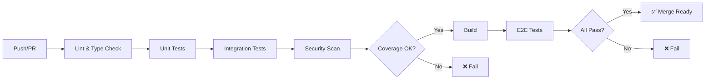

# CERNIQ.APP — TESTING STRATEGY OVERVIEW

## Document canonic pentru strategia de testare

**Versiunea:** 1.0 | **Data:** 20 Ianuarie 2026 | **Status:** NORMATIV  
**Guvernanță:** Subordinat [Master Specification v1.2](../specifications/master-specification.md)

---

## CUPRINS

1. [Principii Fundamentale](#1-principii-fundamentale)
2. [Test Pyramid](#2-test-pyramid)
3. [Coverage Requirements](#3-coverage-requirements)
4. [CI/CD Integration](#4-cicd-integration)
5. [Environments](#5-environments)
6. [Quality Gates](#6-quality-gates)

---

## 1. PRINCIPII FUNDAMENTALE

### 1.1 Filosofie de Testare

> **"Test early, test often, test automatically."**

Cerniq.app adoptă o abordare **Shift-Left Testing** — testele sunt scrise și executate cât mai devreme în ciclul de dezvoltare, nu la final.

### 1.2 Principii Cheie

| # | Principiu | Descriere |
| - | --------- | --------- |
| 1 | **Determinism** | Testele produc același rezultat la fiecare rulare |
| 2 | **Izolare** | Fiecare test este independent, fără dependențe de ordine |
| 3 | **Viteză** | Unit tests < 10ms, Integration < 1s, E2E < 30s |
| 4 | **Claritate** | Numele testului descrie comportamentul așteptat |
| 5 | **Mentenabilitate** | DRY în fixtures, explicit în assertions |

### 1.3 Anti-Patterns de Evitat

- ❌ **Flaky Tests** — Teste care eșuează intermitent
- ❌ **Test Interdependency** — Teste care depind de ordinea execuției
- ❌ **Excessive Mocking** — Mock-uri care ascund bug-uri reale
- ❌ **Sleeping in Tests** — Folosirea `sleep()` în loc de polling/events
- ❌ **Testing Implementation** — Testarea detaliilor de implementare, nu a comportamentului

---

## 2. TEST PYRAMID

### 2.1 Structura Piramidei

```text
                    ┌─────────┐
                    │   E2E   │ 10% — Playwright, Browser Tests
                    │  Tests  │ Real user flows, critical paths
                   ─┴─────────┴─
                  ┌─────────────┐
                  │ Integration │ 20% — API, Database, External Services
                  │   Tests     │ Service boundaries, contracts
                 ─┴─────────────┴─
                ┌─────────────────┐
                │   Unit Tests    │ 70% — Functions, Classes, Modules
                │                 │ Business logic, edge cases
                └─────────────────┘
```

### 2.2 Distribuție per Tip

| Tip Test | Procentaj | Număr Estimat | Timp Execuție |
| -------- | --------- | ------------- | ------------- |
| **Unit** | 70% | ~2000+ | < 30 secunde |
| **Integration** | 20% | ~600+ | < 5 minute |
| **E2E** | 10% | ~300+ | < 15 minute |

### 2.3 Ownership per Layer

| Layer | Owner | Când se scriu |
| ------- | ------- | ------------- |
| Unit | Developer | Cu fiecare funcție/clasă nouă |
| Integration | Developer + QA | La fiecare endpoint/worker nou |
| E2E | QA + Product | La fiecare user story completat |

---

## 3. COVERAGE REQUIREMENTS

### 3.1 Targets Canonice (Master Spec)

Țintele de coverage sunt definite canonic în Master Spec § 2.10.8. Toate valorile din această documentație trebuie să urmeze acea secțiune:

- [Master Spec — Canonical Test Coverage Targets](../specifications/master-specification.md#2108-canonical-test-coverage-targets-single-source-of-truth)

### 3.2 Critical Paths (95%+ Coverage)

Următoarele componente necesită coverage > 95%:

- **HITL Approval Service** — Decizii de business critice
- **Payment Processing** — Revolut webhooks, reconciliation
- **e-Factura Generation** — Conformitate fiscală
- **Lead Scoring Algorithm** — Core business logic
- **Data Promotion** — Bronze → Silver → Gold

### 3.3 Enforcing Coverage

```yaml
# vitest.config.ts
export default defineConfig({
  test: {
    coverage: {
      provider: 'v8',
      reporter: ['text', 'json', 'html'],
      thresholds: {
        lines: 80,
        functions: 80,
        branches: 75,
        statements: 80,
      },
      exclude: [
        'node_modules/**',
        'dist/**',
        '**/*.d.ts',
        '**/*.test.ts',
        '**/fixtures/**',
      ],
    },
  },
});
```

---

## 4. CI/CD INTEGRATION

### 4.1 Pipeline Stages



### 4.2 GitHub Actions Jobs

| Job | Trigger | Timeout | Fail Condition |
| ----- | --------- | --------- | ---------------- |
| `lint` | All PRs | 5 min | Any error |
| `typecheck` | All PRs | 5 min | TS errors |
| `test:unit` | All PRs | 10 min | Any failure |
| `test:integration` | All PRs | 15 min | Any failure |
| `test:e2e` | Main, Release | 30 min | Any failure |
| `coverage` | All PRs | 5 min | < 80% |
| `security` | All PRs | 10 min | HIGH/CRITICAL |

### 4.3 Required Checks

```yaml
# .github/branch-protection.yml
required_status_checks:
  strict: true
  contexts:
    - lint
    - typecheck
    - test:unit
    - test:integration
    - coverage
    - security
```

---

## 5. ENVIRONMENTS

### 5.1 Environment Matrix

| Environment | Baza de Date | Redis | External APIs | Scop |
| ----------- | ------------ | ----- | ------------- | ---- |
| **local** | Docker | Docker | Mocked | Development |
| **test** | Ephemeral | Ephemeral | Mocked | CI Pipeline |
| **staging** | Persistent | Persistent | Sandbox | Pre-production |
| **production** | Persistent | Persistent | Live | Production |

### 5.2 Test Database Strategy

```typescript
// test/setup.ts
import { drizzle } from 'drizzle-orm/node-postgres';
import { migrate } from 'drizzle-orm/node-postgres/migrator';

beforeAll(async () => {
  // Create ephemeral test database
  testDb = await createTestDatabase();
  await migrate(testDb, { migrationsFolder: './drizzle' });
  await seedTestData(testDb);
});

afterAll(async () => {
  await dropTestDatabase(testDb);
});

beforeEach(async () => {
  // Transaction rollback for isolation
  await testDb.execute(sql`BEGIN`);
});

afterEach(async () => {
  await testDb.execute(sql`ROLLBACK`);
});
```

### 5.3 External API Mocking

| API | Test Strategy | Tool |
| ----- | ------------- | ---- |
| ANAF SPV | Mock server | MSW |
| Termene.ro | Fixtures | Vitest mocks |
| TimelinesAI | Nock intercepts | Nock |
| Revolut | Webhook simulator | Custom |
| OpenAI | Response fixtures | MSW |

---

## 6. QUALITY GATES

### 6.1 PR Merge Requirements

Toate PRs trebuie să îndeplinească:

- [ ] ✅ Toate testele trec (unit, integration)
- [ ] ✅ Coverage ≥ 80%
- [ ] ✅ No HIGH/CRITICAL vulnerabilities
- [ ] ✅ TypeScript strict mode — zero errors
- [ ] ✅ ESLint — zero errors, max 5 warnings
- [ ] ✅ At least 1 approval review
- [ ] ✅ All conversations resolved

### 6.2 Release Requirements

Pentru release în production:

- [ ] ✅ E2E tests pass pe staging
- [ ] ✅ Performance tests pass (k6)
- [ ] ✅ Security scan clean
- [ ] ✅ CHANGELOG updated
- [ ] ✅ Version bumped (semver)
- [ ] ✅ Stakeholder sign-off

### 6.3 Hotfix Requirements

Pentru hotfix-uri critice:

- [ ] ✅ Unit test pentru bug fix
- [ ] ✅ Integration test pentru affected flow
- [ ] ✅ Smoke test pe staging
- [ ] ✅ Incident owner approval

---

## DOCUMENTE CONEXE

| Document | Scop |
| -------- | ---- |
| [01-testing-types-catalog.md](./01-testing-types-catalog.md) | Catalog tipuri de teste |
| [02-testing-tools-stack.md](./02-testing-tools-stack.md) | Tooling și configurare |
| [03-testing-conventions.md](./03-testing-conventions.md) | Naming și patterns |
| [etapa-0/e0-index.md](./etapa-0/e0-index.md) | Teste infrastructură |
| [etapa-1/e1-index.md](./etapa-1/e1-index.md) | Teste data enrichment |

---

**Document generat:** 20 Ianuarie 2026  
**Autor:** Software Architect  
**Conformitate:** Master Spec v1.2, ADR-0029
